# Book Techyo (.NET MAUI Version)

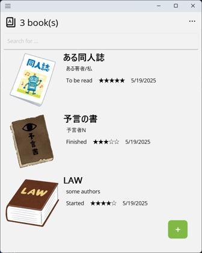

## 1. Description

An application for managing book impressions and notes.

It works on Windows 11[^0] and Android[^2] smartphones with [.Net 9](https://dotnet.microsoft.com/ja-jp/) installed.

You can register books by scanning their barcodes with the camera.

You can also import records created with [読書管理ビブリア](https://biblia978.com/) or [ブクログ](https://booklog.jp/).

### 1-1. Why I Created It

I used to use 読書管理ビブリア on an iPhone SE[^1], but after switching to a Google Pixel[^2], I needed a free, ad-free app.

I could have simply imported the CSV files exported from Biblia into existing Android apps ([Yomoo](https://play.google.com/store/apps/details?id=com.nosuke.yomoo&hl=ja), [bondavi’s record](https://play.google.com/store/apps/details?id=jp.bondavi.likes.global&hl=ja), [Book Manager](https://play.google.com/store/apps/details?id=com.bsy_web.bookmanager&hl=ja), etc.), but I decided to implement my own app to address the following issues and add features:

- Annoying advertisements  
- Bugs that never get fixed  
- Want to register books from [Aozora Bunko](https://www.aozora.gr.jp/)

### 1-2. Book Data

This App uses NDL Search API.
Metadata Source: National Diet Library Catalog [Creative Commons Attribution 4.0 International Public License](https://creativecommons.org/licenses/by/4.0/legalcode.en).

Some book cover images are provided by the [Japan Publication Registry Office (JPRO)](https://jpro2.jpo.or.jp/).

## 2. How to Use

After launching **Book Techyo**, register your book records.

When finished, close **Book Techyo**.

### 2-1. Launching Book Techyo

Launch the app by clicking **Book Techyo**  from Windows startup, etc.

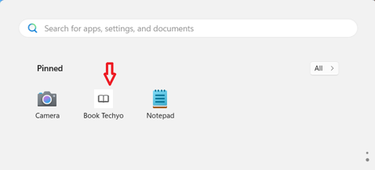

### 2-1-1. Before You Start

Before searching for books, click the book search service URL in the [Configuration Page](#3-configuration) and review the terms of use. If you do not agree, uncheck the option to disable its use.

### 2-2. Registering a Book Record

Click  in **Book Techyo**.

Clicking  displays options for barcode scanning , searching by book title , or adding an empty record .

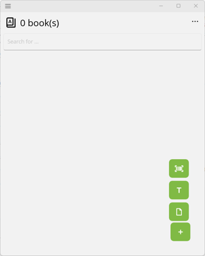

#### 2-2-1. Barcode Scanning

Click .

**Book Techyo** displays the barcode scanning screen.

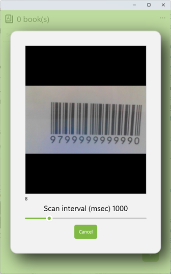

At this point, a screen may appear asking whether to allow access to the camera and microphone. Click [Yes] to allow.

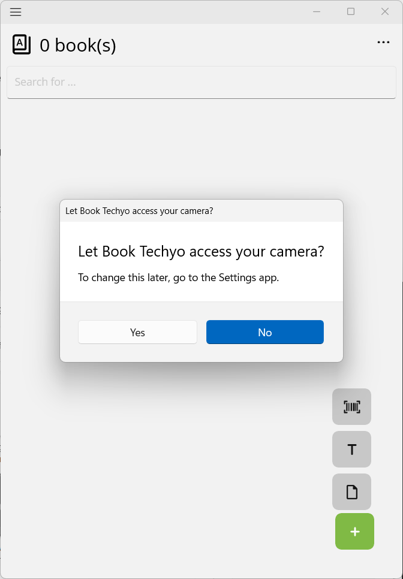  

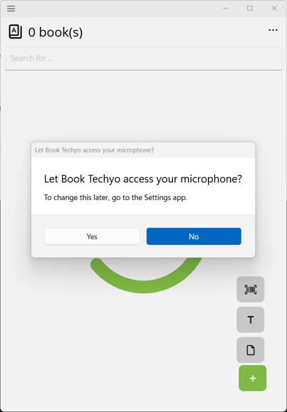

Hold the book’s barcode up to the camera and adjust until the scan succeeds.

The number in the top-left corner of the camera feed shows the number of scan attempts.

You can adjust the scan interval below the camera feed.  
Smaller intervals increase the chance of quicker success but put more load on the system.

When a barcode scan succeeds, **Book Techyo** searches with the scanned ISBN and displays results.

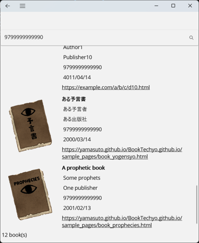

Double-click a book in the list.

**Book Techyo** reflects the search results in the book record detail screen.

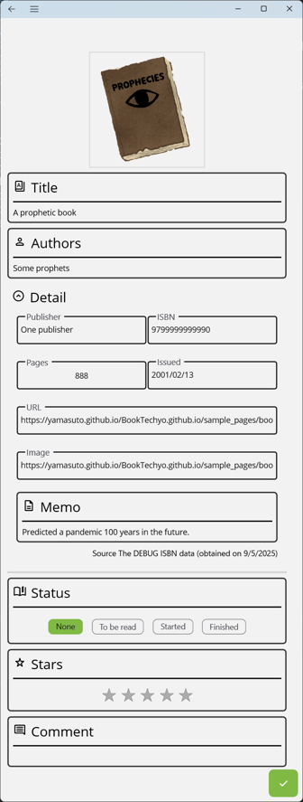

Enter details and click . **Book Techyo** registers it in the list.

- Each field can be left empty or as default.  
- You can use `#` in Comments to set tags. **Tag search will be supported in the future.**

##### 2-2-1-1. Notes on Barcode Scanning

- On some PCs, **the Windows Camera app can scan barcodes more easily and smoothly**.  

  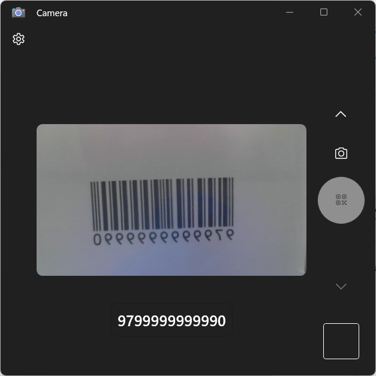

- Barcode scanning works only when a **camera is available**. If the PC has no camera, or another app is using it, barcode scanning will not work.

#### 2-2-2. Searching the Internet by Book Title

Click .

**Book Techyo** displays the search screen.

Enter the book title in the text box and click . **Book Techyo** performs the search and lists results.

- Entering a book title searches by title.  
- Entering an ISBN searches by ISBN (e.g., 9799999999990 or 979-9-999-99999-0).  
- The search service used and maximum number of results per service can be set in the [Configuration page](#3-configuration).  

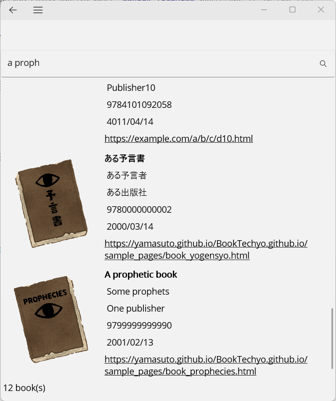

Double-click a book in the list.

**Book Techyo** reflects the search results in the detail screen.

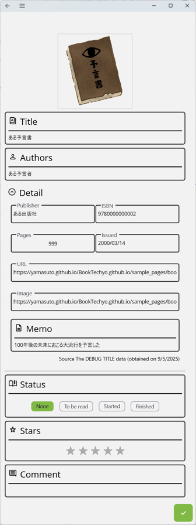

Enter details and click . **Book Techyo** registers it in the list.

- Each field can be left empty or as default.  
- You can use `#` in Comments to set tags. **Tag search will be supported in the future.**

#### 2-2-3. Adding an Empty Record

Click .

**Book Techyo** displays the detail screen for an empty record.

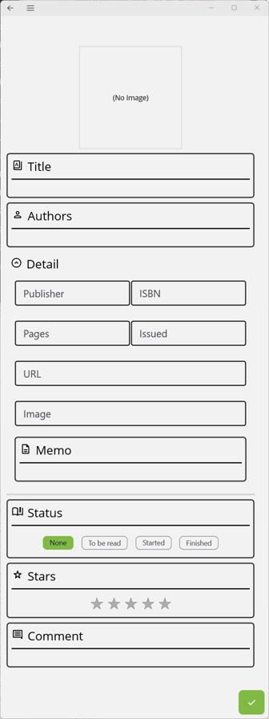

Enter details and click . **Book Techyo** registers it in the list.

### 2-3. Editing a Book Record

Double-click a record in **Book Techyo** to open its detail screen.

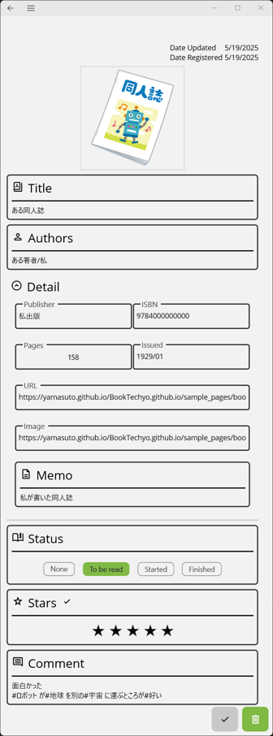

- The image at the top displays the image from the URL in the image text box. If the URL is empty or inaccessible, no image is shown.  
- Clicking the image opens the URL in your web browser.  
- Each field can be left empty or as default.  
- You can use `#` in Comments to set tags. **Tag search will be supported in the future.**

Make changes and click .

**Book Techyo** updates the record.

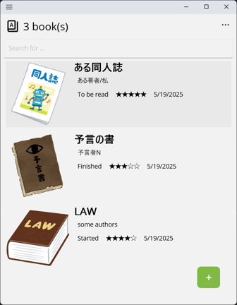

To delete a record, click  in the detail screen.

### 2-4. Searching Book Records

You can search by text or by status.

<!-- Tag search planned for future -->

#### 2-4-1. Searching by Title, etc.

Search book records that contain the specified text in title, author, description, or comment.

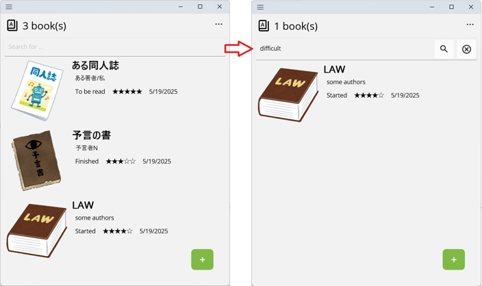

Enter text in the search box and press ENTER or click .

Only matching records are shown.

To cancel search results, click .

#### 2-4-2. Filtering by Status and Sorting

Click [・・・] in the top-right of **Book Techyo**, then select [Status Filter] or [Sort]. The bottom panel will show filter and sorting options.

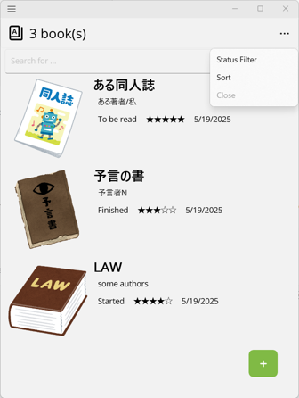  

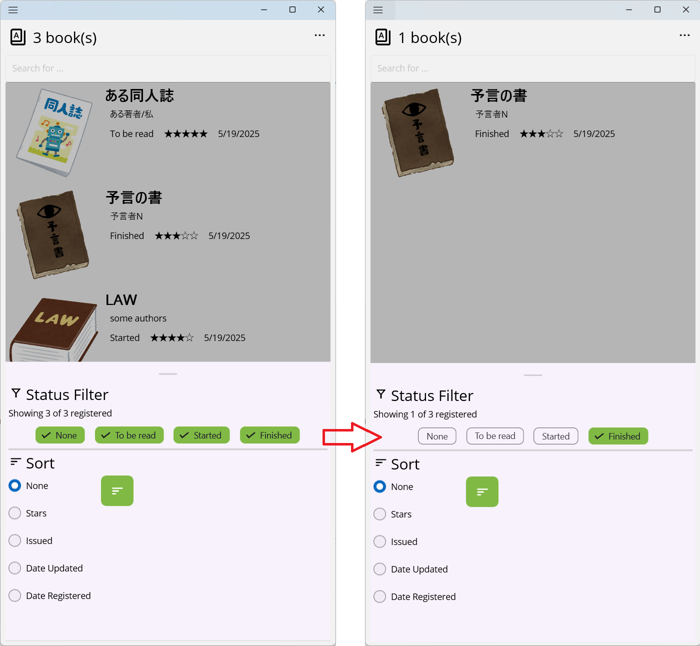

The status filter shows only records with the checked status.

Click a status to toggle check on/off, updating the list.

For sorting, choose target and direction, then click  to reorder the list.

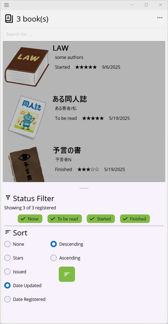

| Target | Description |
|-|-|
| None | Default view, ordered by registration. |
| Stars | Sort by rating. |
| Publication Date | Sort by publication date. |
| Update Date | Sort by last updated date. |
| Registration Date | Sort by registration date. |

| Direction | Description |
|-|-|
| Descending | From larger to smaller values, or newer to older dates. |
| Ascending | From smaller to larger values, or older to newer dates. |

※ When [None] is selected, [Direction] is hidden.

To close the filter/sort panel, click [Close] in the top-right or click the list area.

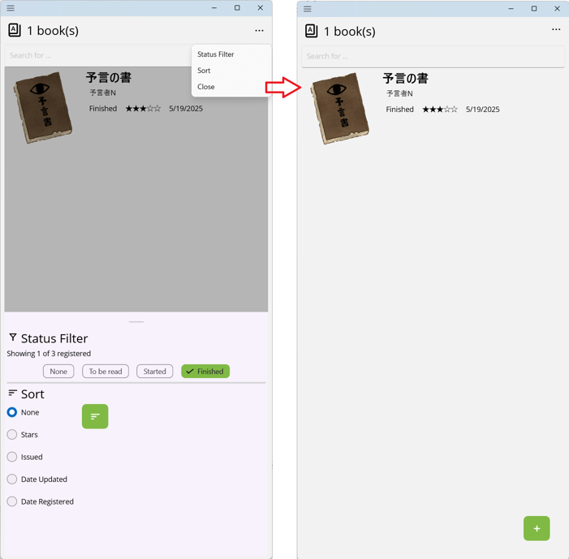

### 2-5. Exiting Book Techyo

Click  in the top-right of **Book Techyo**, or right-click **Book Techyo** in the taskbar and select [Close Window].

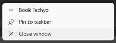

At this time, **Book Techyo discards any unsaved changes**, so please be careful.  

## 3. Configuration

Click the  icon at the top left of **Book Techyo**, then select [Configuration] from the displayed menu to open the Configuration page.

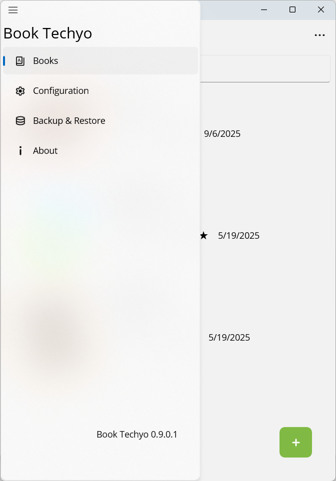

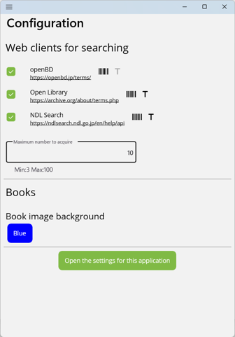

The Configuration page contains, from top to bottom:

- Enable/disable book search services and set their priority
- Maximum number of results retrieved from each book search service
- Background color setting for book cover images
- Button to open the app settings

### 3-1. Enable/disable book search services and set their priority

**Before performing a search, please click the URL of the book search service to review its terms of use. If you do not agree, uncheck the box to disable that service.**

Book searches will use the services with their checkboxes enabled.  

If all checkboxes are unchecked, no search will be performed.  

Searches are performed in the order that the services are listed, from top to bottom.  

If the service shows  in color (not gray), it will be used for ISBN searches. If it shows  in color (not gray), it will be used for title searches.

| Service | Homepage | Description |
|-|-|-|
| openDB | <https://openbd.jp/> | Search by ISBN |
| Open Library | <https://openlibrary.org/> | Search by ISBN and title |
| National Diet Library Search | <https://ndlsearch.ndl.go.jp/> | Search by ISBN and title |

### 3-2. Maximum number of results retrieved from each book search service

Specify an integer between 3 and 100.

### 3-3. Background color setting for book cover images

Specify the background color for book cover images. The default is transparent.

### 3-4. Button to open the app settings

Click to open the app settings screen.

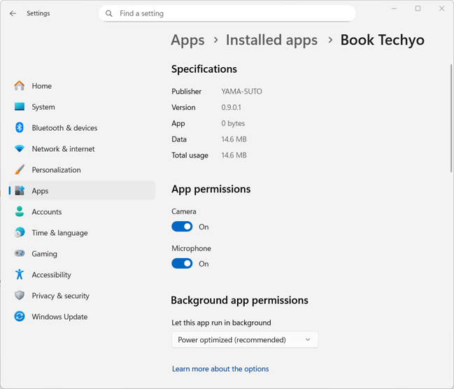

## 4. Backup and Restore

Click the  icon at the top left of **Book Techyo**, then select [Backup and Restore] from the displayed menu to open the backup and restore screen.

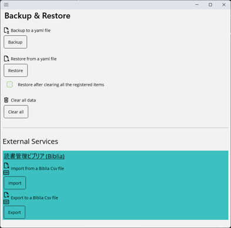

The backup and restore screen contains, from top to bottom:

- Backup button
- Restore button
- Delete all button
- External services
  - Biblia
    - Import button
    - Export button
  - Booklog
    - Import button

### 4-1. Backup button

Click to export your registered book records to a specified file in Yaml format.

- The Yaml file can be opened and edited with a text editor such as Windows Notepad. If you edit it, make sure not to change the format, character encoding, or line endings.  
- The Yaml file uses UTF-8 (without BOM) encoding and CRLF line endings.

### 4-2. Restore button

Click to import book records from the specified file and **add** them to the existing records.

If you want to delete all existing records before restoring, check the [Restore after clearing all the registered items] checkbox and then click the button.

### 4-3. Delete all button

Click to delete all registered book records.

### 4-4. External services

#### 4-4-1. Biblia

- **Import**: Import the [CSV file](https://biblia978.com/support/articles/15/) exported to Dropbox by [読書管理ビブリア](https://biblia978.com/).  
- **Export**: Export registered book records to a [CSV file](https://biblia978.com/support/articles/15/) that can be restored by [読書管理ビブリア](https://biblia978.com/).

読書管理ビブリア backups are created in [Dropbox](https://www.dropbox.com/). Since **Book Techyo** cannot directly access Dropbox, I use the [Dropbox Lite](https://apps.microsoft.com/detail/9WZDNCRFJ0PK?hl=en&gl=JP&ocid=pdpshare) app installed on Windows to perform import and export as follows:

- **To import into Book Techyo**
  1. Perform a backup in 読書管理ビブリア.  
  2. Launch Dropbox Lite (using the same Dropbox account as Biblia).  
  3. In Dropbox Lite, select `Dropbox/Apps/Biblia/books.csv` and save it to a local Windows folder (e.g., Documents) using “Save As.”  
  4. In **Book Techyo**, delete all records, then import the previously saved CSV file.

- **To export from Book Techyo and restore in Biblia**
  1. In **Book Techyo**, use the [Biblia] [Export] option and save the file as `books.csv`.  
  2. Upload the `books.csv` file to `Dropbox/Apps/Biblia` using Dropbox Lite.  
  3. In 読書管理ビブリア, delete all existing data and then perform a restore.

#### 4-4-2. Booklog

- **Import**: Import the [CSV file](https://booklog.zendesk.com/hc/ja/articles/360048930533-%E4%BB%96%E3%81%AE%E8%AA%AD%E6%9B%B8%E7%AE%A1%E7%90%86%E3%82%B5%E3%82%A4%E3%83%88%E3%81%8B%E3%82%89%E3%83%96%E3%82%AF%E3%83%AD%E3%82%B0%E3%81%B8%E3%83%87%E3%83%BC%E3%82%BF%E3%82%92%E7%A7%BB%E8%A1%8C%E3%81%97%E3%81%9F%E3%81%84%E3%81%A7%E3%81%99) exported from the web version of [ブクログ](https://booklog.jp/).  

※ Export is not supported.

## 5. About Book Techyo

Click the  icon at the top left of **Book Techyo**, then select [About Book Techyo] from the displayed menu to open the about screen.

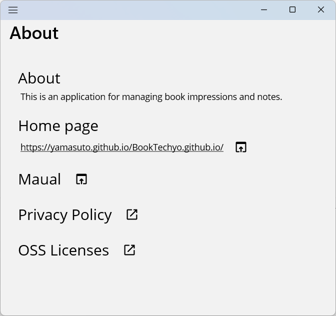

From top to bottom, it displays links to the homepage, user guide, privacy policy, and OSS licenses.

## 6. Contact

If you have any questions or inquiries regarding this app, please [contact us via the homepage](https://yamasuto.github.io/BookTechyo.github.io/contact/ja-JP/).

---

[^0]: Window is registered trademarks of Microsoft Corporation in the United States and/or other contries.  
[^1]: iPhone is a trademark of Apple Inc., registered in the U.S. and other countries. The iPhone trademark is used under license from Aiphone Co., Ltd (in Japanese only).
[^2]: "Google," "Google Pixel," and "Android" are trademarks of Google LLC.
