# Book Techyo (Windows Store App Version)<!-- screen vs view vs window vs page => Page -->

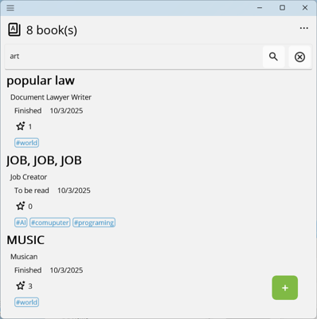

Table of contents

- [Book Techyo (Windows Store App Version)](#book-techyo-windows-store-app-version)
  - [1. Description](#1-description)
    - [1-1. Why I Created It](#1-1-why-i-created-it)
    - [1-2. Book Data](#1-2-book-data)
    - [1-3. Privacy Policy](#1-3-privacy-policy)
    - [1-4. Software Dependencies](#1-4-software-dependencies)
  - [2. How to Use](#2-how-to-use)
    - [2-1. Launching Book Techyo](#2-1-launching-book-techyo)
    - [2-2. Before You Start](#2-2-before-you-start)
    - [2-3. Registering a Book Record](#2-3-registering-a-book-record)
    - [2-4. Exiting Book Techyo](#2-4-exiting-book-techyo)
  - [3. Menu](#3-menu)
    - [3-1. Books](#3-1-books)
      - [3-1-1. Registering a Book Record](#3-1-1-registering-a-book-record)
      - [3-1-1-1. Barcode Scanning](#3-1-1-1-barcode-scanning)
        - [3-1-1-1-A. Notes on Barcode Scanning](#3-1-1-1-a-notes-on-barcode-scanning)
      - [3-1-1-2. Searching the Internet by Book Title](#3-1-1-2-searching-the-internet-by-book-title)
      - [3-1-1-3. Adding an Empty Record](#3-1-1-3-adding-an-empty-record)
      - [3-1-2. Enter, edit, or delete book records](#3-1-2-enter-edit-or-delete-book-records)
      - [3-1-2-1. Trophy](#3-1-2-1-trophy)
      - [3-1-3. Search and sort book records](#3-1-3-search-and-sort-book-records)
        - [3-1-3-1. Searching by Title, etc](#3-1-3-1-searching-by-title-etc)
        - [3-1-3-2. Filtering by Status and Sorting](#3-1-3-2-filtering-by-status-and-sorting)
    - [3-2. Chart](#3-2-chart)
    - [3-3. Configuration](#3-3-configuration)
      - [3-3-1. Enable/disable book search services and set their priority](#3-3-1-enabledisable-book-search-services-and-set-their-priority)
      - [3-3-2. Maximum number of results retrieved from each book search service](#3-3-2-maximum-number-of-results-retrieved-from-each-book-search-service)
      - [3-3-3. Whether to show book cover images](#3-3-3-whether-to-show-book-cover-images)
      - [3-3-4. Background color setting for book cover images](#3-3-4-background-color-setting-for-book-cover-images)
      - [3-3-5. Whether to Search for books using the copied ISBN](#3-3-5-whether-to-search-for-books-using-the-copied-isbn)
      - [3-3-6. Button to open the app settings](#3-3-6-button-to-open-the-app-settings)
    - [3-4. Backup and Restore](#3-4-backup-and-restore)
      - [3-4-1. Backup button](#3-4-1-backup-button)
      - [3-4-2. Restore button](#3-4-2-restore-button)
      - [3-4-3. Delete all button](#3-4-3-delete-all-button)
      - [3-4-4. External services](#3-4-4-external-services)
        - [3-4-4-1. '読書管理ビブリア'](#3-4-4-1-読書管理ビブリア)
    - [3-5. About Book Techyo](#3-5-about-book-techyo)
  - [4. Contact](#4-contact)

## 1. Description

An application for managing book reviews and notes.

It works on Windows 11[^0] computers and Android[^2] smartphones.

You can register books by scanning their barcodes with the camera.

You can also import records created with '[読書管理ビブリア](https://biblia978.com/)'.

### 1-1. Why I Created It

I used to use '読書管理ビブリア' on an iPhone SE[^1], but after switching to a Google Pixel[^2], I needed an app that is free and ad-free.

I could have simply imported the CSV files exported from '読書管理ビブリア' into existing Android apps, but I decided to implement my own app to address the following issues and add features:

- Annoying advertisements  
- Bugs that never get fixed  
- Want to register books from [Aozora Bunko](https://www.aozora.gr.jp/)

### 1-2. Book Data

This app uses NDL (National Diet Library) Search API.

Metadata Source: National Diet Library Catalog [Creative Commons Attribution 4.0 International Public License](https://creativecommons.org/licenses/by/4.0/legalcode.en).

Unfortunately, I was *unable* to obtain the cover images. I contacted the image provider but could not confirm use rights.

### 1-3. Privacy Policy

This app's [Privacy Policy](./PrivacyPolicy.md)

### 1-4. Software Dependencies

This app depends on **.NET 9.0**.

If **.NET 9.0** is not installed, please download and install it from <https://dotnet.microsoft.com/download>.

## 2. How to Use

After launching **Book Techyo**, register your book records.

When you are finished, close **Book Techyo**.

### 2-1. Launching Book Techyo

Launch the app by clicking **Book Techyo**  from the Windows Start menu or other shortcuts.

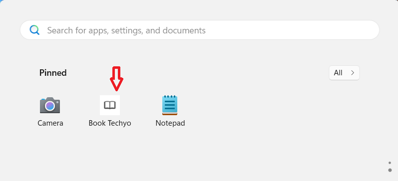

### 2-2. Before You Start

Upon first launch after installing the app, a message will appear asking you to accept the terms of use for the book search service.

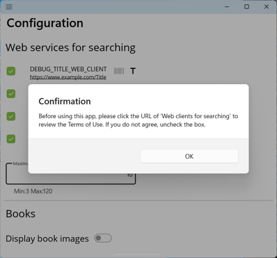

Click the OK button to close the message, then click the book search service URL on the [Configuration](#3-3-configuration) to review the terms of use. If you do not agree, uncheck the box to opt out.

### 2-3. Registering a Book Record

You can register books individually or import a file to register them in bulk.

- To register books individually, search by book title or scan the book’s barcode (ISBN) using the camera.
- To register books in bulk via file import, use either a YAML file created from a backup or a CSV file exported from '読書管理ビブリア'.

### 2-4. Exiting Book Techyo

Click  in the top-right of **Book Techyo**, or right-click **Book Techyo** in the taskbar and select [Close Window].

At this time, **Book Techyo discards any unsaved changes**, so please be careful.  

## 3. Menu

Click the  icon at the top left of **Book Techyo** to display the menu.

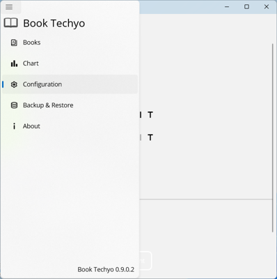

### 3-1. Books

Display a list of book records.

A book record displays the title, authors, status, update date, rating, trophy status, and tags.

#### 3-1-1. Registering a Book Record

Click  in **Book Techyo**.

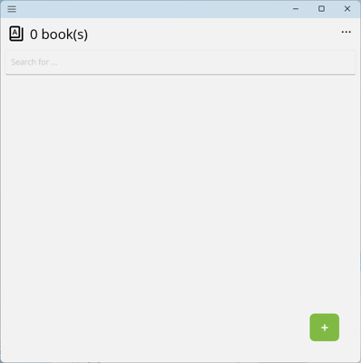

Clicking  displays options to scan a barcode , search by book title , or add an empty record .

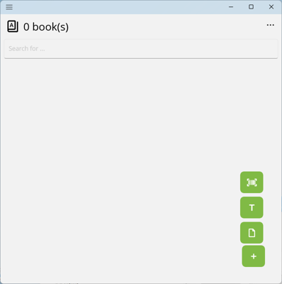

When you copy an ISBN from other apps, **Book Techyo** will display  in addition to the above.
Clicking that will prompt to search using the copied ISBN and display the results.
Note that the function to search using copied ISBNs can be toggled on and off in the [Configuration](#3-3-configuration).

#### 3-1-1-1. Barcode Scanning

Click .

**Book Techyo** displays the barcode scanning popup.

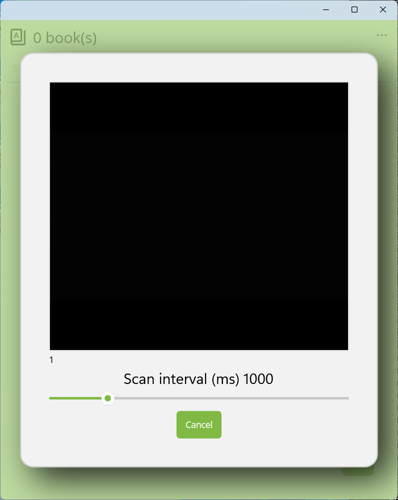

At this point, a confirmation may appear asking whether to allow access to the camera and microphone. Click [Yes] to allow.

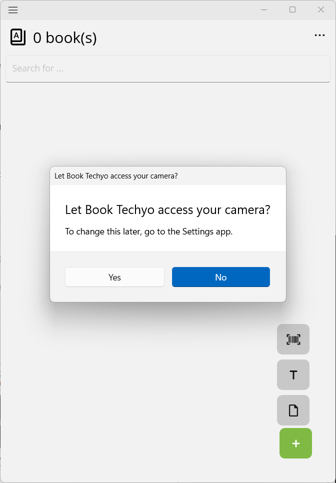  

Hold the book’s barcode in front of the camera and adjust until it scans successfully.

The number in the top-left corner of the camera feed shows the number of scan attempts.

You can adjust the scan interval below the camera feed.  
Smaller intervals increase the chance of quicker success but put more load on the system.

When a barcode scan succeeds, **Book Techyo** searches with the scanned ISBN and displays results.

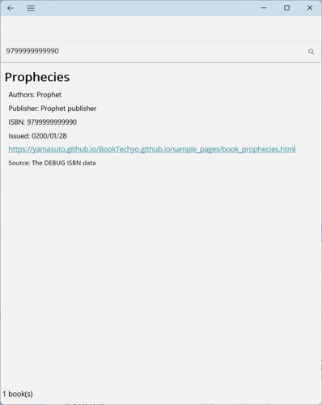

Double-click a book in the list.

**Book Techyo** reflects the search results in the [book detail](#3-1-2-enter-edit-or-delete-book-records).

Enter details and click . **Book Techyo** registers it in the list.

##### 3-1-1-1-A. Notes on Barcode Scanning

- On some PCs, **the Windows Camera app can scan barcodes more easily and smoothly**.  

  

  When you copy an ISBN from **the Windows Camera app**, **Book Techyo** will display .
  Clicking that will prompt to search using the copied ISBN and display the results.

   

  Note that the function to search using copied ISBNs can be toggled on and off in the [Configuration](#3-3-configuration).

- Barcode scanning works only when a **camera is available**. If the PC has no camera, or another app is using it, barcode scanning will not work.

#### 3-1-1-2. Searching the Internet by Book Title

Click .

**Book Techyo** displays the search page.

Enter the book title in the text box and click . **Book Techyo** performs the search and lists results.

- Entering a book title searches by title.  
- Entering an ISBN searches by ISBN (e.g., `9799999999990` or `979-9-999-99999-0`).  
- Specifying “title: (book title) author: (book author name)” in the text box will search by title and author name.
  - e.g., `title: 草枕 author: 夏目漱石`
  - You can search by title only or author name only.
  - To retrieve a list of an author's books on Aozora Bunko, enter `author: (book author's name)`.
- The search service used and maximum number of results per service can be set in the [Configuration](#3-3-configuration).  

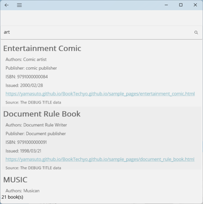

Double-click a book in the list.

**Book Techyo** reflects the search results in the [book detail](#3-1-2-enter-edit-or-delete-book-records).

Enter details and click . **Book Techyo** registers it in the list.

#### 3-1-1-3. Adding an Empty Record

Click .

**Book Techyo** displays the [book detail](#3-1-2-enter-edit-or-delete-book-records) for an empty record.

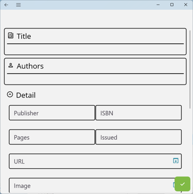

Enter details and click . **Book Techyo** registers it in the list.

#### 3-1-2. Enter, edit, or delete book records

When you create or open a book record in **Book Techyo**, the [book detail](#3-1-2-enter-edit-or-delete-book-records) will appear.

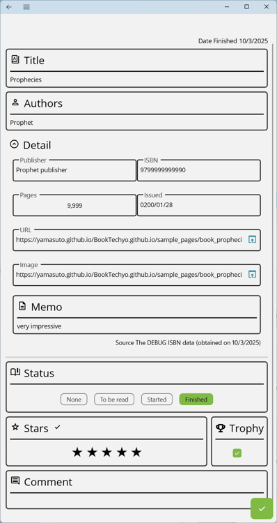

- Each field can be left empty or as default.

Click the title or authors field to open a popup. Enter the title and author(s), then click the [Apply] button.

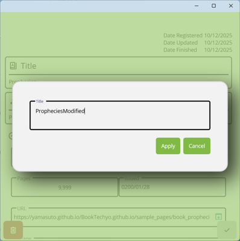

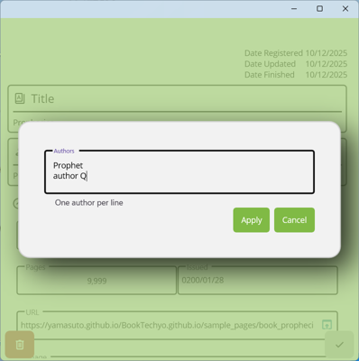

Clicking Memo or Comment will open the corresponding input page.

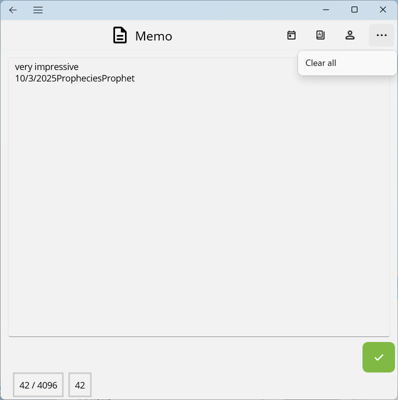

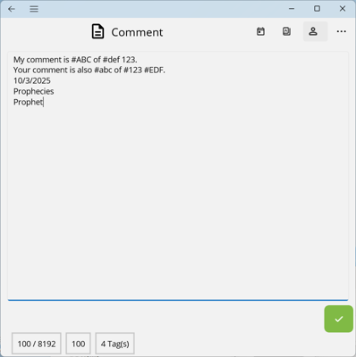

- You can enter [Today's Date], [Title], and [Author Name] in the toolbar at the top right of the page.
- You can use `#` in Comments to set tags. You can search by tag later.

Make your changes and click .

**Book Techyo** updates the record.

To discard changes and return to the previous page, click  in the upper-left corner of the page.

Note: When you double-click a registered book record to display the [book detail](#3-1-2-enter-edit-or-delete-book-records), clicking the  button will **delete** the record.

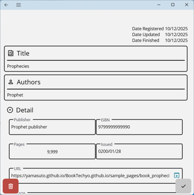

#### 3-1-2-1. Trophy

The Trophy feature marks the book you choose as the most interesting of the year.

- You can toggle the checkbox on or off independently of other items (such as [Status] or [Stars]).
- Check the [Trophy] to display the [trophy](../../common/images/trophy_32dp_1F1F1F_FILL0_wght400_GRAD0_opsz40.png) in the list as well.
- You can search by specifying whether [Trophy] is on or off.

#### 3-1-3. Search and sort book records

You can search your registered book records by title or status. You can also sort them by date or other criteria.

##### 3-1-3-1. Searching by Title, etc

Search book records that contain the specified text in title, author, Memo, or comment.

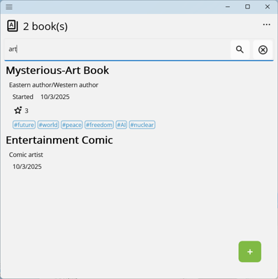

Enter text in the search box and press ENTER or click .

Only matching records are displayed.

To clear the search results, click .

- Entering an item name and search string in the text box will search only within the specified item. For example: `title: Book Title to Find`.
  - Available item names are title, authors, publisher, memo, comment, and tag. Searches will target only the title, authors, publisher, memo, comment, or tag, respectively.
  - Only one item name can be specified.

##### 3-1-3-2. Filtering by Status and Sorting

Click  in the top-right of **Book Techyo**, then select [Filter] or [Sort]. The bottom panel will show filter and sorting options.

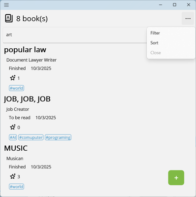

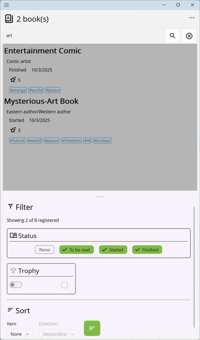

- Only items with the **checkbox selected** will be displayed in the list. Clicking to toggle the checkbox will update the list display.
- For the [Trophy] feature, first turn on the [switch] on the left, then use the [Checkbox] to choose whether the trophy is on or off. Toggling the checkbox will update the list display.

For sorting, choose target and direction, then click  to reorder the list.

Target

| Target | Description |
|-|-|
| None | Default view, ordered by registration. |
| Stars | Sort by rating. |
| Publication Date | Sort by publication date. |
| Update Date | Sort by last updated date. |
| Registration Date | Sort by registration date. |

Direction

| Direction | Description |
|-|-|
| Descending | From larger to smaller values, or newer to older dates. |
| Ascending | From smaller to larger values, or older to newer dates. |

※ When [None] is selected, [Direction] is hidden.

To close the filter/sort panel, click [Close] in the top-right or click the list area.

### 3-2. Chart

Click the  icon at the top left of **Book Techyo**, then select [Chart] from the displayed menu to open the Chart page.

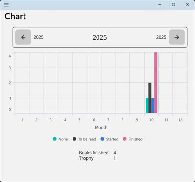

Displays the number of books registered in the selected year by status in a Column chart.

Below the chart, displays the total number of books finished reading in the year and the total number of books marked with [Trophy].

### 3-3. Configuration

Click the  icon at the top left of **Book Techyo**, then select [Configuration] from the displayed menu to open the Configuration page.

The Configuration page contains, from top to bottom:

- Enable/disable book search services and set their priority
- Maximum number of results retrieved from each book search service
- Whether to show book cover images in listings
- Background color setting for book cover images
- Whether to Search for books using the copied ISBN
- Button to open the app settings

Note that `DEBUG_TITLE_WEB_CLIENT` and `DEBUG_ISBN_WEB_CLIENT` in the image are for the development web client. They will not be displayed in **Book Techyo** obtained from the app store.

#### 3-3-1. Enable/disable book search services and set their priority

**Before performing a search, please click the URL of the book search service to review its terms of use. If you do not agree, uncheck the box to disable that service.**

Book searches will use the services with their checkboxes enabled.  

If none of the checkboxes are selected, no search will be performed.  

Searches are performed in the order that the services are listed, from top to bottom.  

If the service’s icon  appears in color (not gray), it will be used for ISBN searches. If its icon  appears in color (not gray), it will be used for title searches.

| Service | Homepage | Description |
|-|-|-|
| National Diet Library Search | <https://ndlsearch.ndl.go.jp/> | Search by ISBN and title |
| Aozora Bunko, National Diet Library Search | <https://ndlsearch.ndl.go.jp/> | Search by title |

- Aozora Bunko, National Diet Library Search performs searches by specifying Aozora Bunko (repository number R000000014) as the data provider in the National Diet Library Search.

#### 3-3-2. Maximum number of results retrieved from each book search service

Specify an integer between 3 and 120.

#### 3-3-3. Whether to show book cover images

Specifies whether to show book cover images in the books page and similar pages. The default is hidden.

Below is a books page showing images when displayed (with the background color also changed).

#### 3-3-4. Background color setting for book cover images

Specify the background color for book cover images. The default is transparent.

Clicking the button displays the background color selection popup.

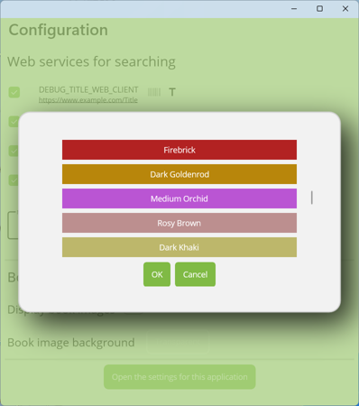

#### 3-3-5. Whether to Search for books using the copied ISBN

Specify whether to read ISBNs copied from other apps. The default is on, meaning it will read them.

When on, copying an ISBN in other apps will display the [search by copied ISBN](../../common/images/content_paste_32dp_000000_FILL0_wght400_GRAD0_opsz40.png) in the list page. Clicking that will prompt to search using the copied ISBN and display the results.

#### 3-3-6. Button to open the app settings

Click to open the app settings page.

### 3-4. Backup and Restore

Click the  icon at the top left of **Book Techyo**, then select [Backup and Restore] from the displayed menu to open the backup and restore page.

The backup and restore page contains, from top to bottom:

- Backup button
- Restore button
- Delete all button
- External services

#### 3-4-1. Backup button

Click to export your registered book records to a specified file.

- The file format is YAML.
- The YAML file can be opened and edited with a text editor such as Windows Notepad. If you edit it, make sure not to change the format, character encoding, or line endings.  
- The YAML file uses UTF-8 (without BOM) encoding and CRLF line endings.

#### 3-4-2. Restore button

Click to import book records from the specified file and **add** them to the existing records.

If you want to clear all existing records before restoring, check the [Clear all existing records before restore] checkbox and then click the button.

#### 3-4-3. Delete all button

Click to delete all registered book records.

#### 3-4-4. External services

##### 3-4-4-1. '読書管理ビブリア'

- **Import**: Import the [CSV file](https://biblia978.com/support/articles/15/) exported to Dropbox[^3] by [読書管理ビブリア](https://biblia978.com/).  
- **Export**: Export registered book records to a [CSV file](https://biblia978.com/support/articles/15/) that can be restored by [読書管理ビブリア](https://biblia978.com/).

読書管理ビブリア backups are created in [Dropbox](https://www.dropbox.com/). Since **Book Techyo** cannot directly access Dropbox, I use the [Dropbox Lite](https://apps.microsoft.com/detail/9WZDNCRFJ0PK?hl=en&gl=JP&ocid=pdpshare) app installed on Windows to perform import and export as follows:

- **To import into Book Techyo**
  1. Perform a backup in 読書管理ビブリア.  
  2. Launch Dropbox Lite (using the same Dropbox account as Biblia).  
  3. In Dropbox Lite, select `Dropbox/Apps/Biblia/books.csv` and save it to a local folder on your Windows computer (e.g., Documents) using “Save As.”  
  4. In **Book Techyo**, delete all records, then import the previously saved CSV file.

- **To export from Book Techyo and restore in '読書管理ビブリア'**
  1. In **Book Techyo**, use the [Biblia] [Export] option and save the file as `books.csv`.  
  2. Upload the `books.csv` file to `Dropbox/Apps/Biblia` using Dropbox Lite.  
  3. In 読書管理ビブリア, delete all existing data and then perform a restore.

### 3-5. About Book Techyo

Click the  icon at the top left of **Book Techyo**, then select [About Book Techyo] from the displayed menu to open the about page.

Clicking [Homepage] or [How to Use] will launch your web browser to display the page.

Clicking [Privacy Policy] will display the following page.

This app's privacy policy can also be viewed on the [webpage](PrivacyPolicy.md).

Clicking [OSS License] displays the OSS licenses used by **Book Techyo** on the following page.

## 4. Contact

If you have any questions or inquiries regarding this app, please [contact via the homepage](https://yamasuto.github.io/BookTechyo.github.io/contact/en-US/).

---

[^0]: Window is a registered trademarks of Microsoft Corporation in the United States and/or other countries.  
[^1]: iPhone is a trademark of Apple Inc., registered in the U.S. and other countries. The iPhone trademark is used under license from Aiphone Co., Ltd (in Japanese only).
[^2]: "Google," "Google Pixel," and "Android" are trademarks of Google LLC.
[^3]: Dropbox and the Dropbox logo are trademarks of Dropbox, Inc.
