# 読書の手帖（.NET MAUI版）

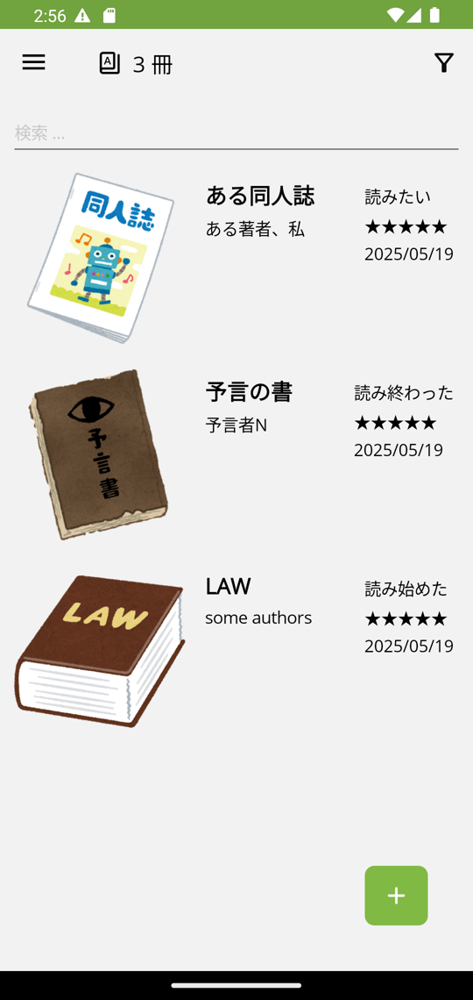

## 1. 説明

本の感想やメモを管理するアプリケーションです。

[.Net 8](https://dotnet.microsoft.com/ja-jp/)をインストールしたWindows 11やAndroidのスマートフォンで動きます。

本のバーコードをカメラで読み取って登録できます。

[読書管理ビブリア](https://biblia978.com/)や[ブクログ](https://booklog.jp/)で作成した記録も読み込めます。

### 1-1. 作成した理由

iPhone SEで読書管理ビブリアを使っていましたが、Pixelに代えたため同じような広告がなく無料で使えるアプリが必要になり作成しました。

読書管理ビブリアでエクスポートしたCsvファイルを既存のアンドロイドアプリ（[Yomoo](https://play.google.com/store/apps/details?id=com.nosuke.yomoo&hl=ja)、[bondaviの記録](https://play.google.com/store/apps/details?id=jp.bondavi.likes.global&hl=ja)、[蔵書マネージャー](https://play.google.com/store/apps/details?id=com.bsy_web.bookmanager&hl=ja)、等）に読み込ませれば済んだのですが、以下解消したり、機能を追加すべく実装することにしました。

- 広告が煩わしい
- 不具合が直らない
- 青空文庫の本を登録したい
- 楽天にない本も登録したい
  - なお、楽天ブックスAPIはアプリIDの管理を本アプリ単体で実装できなかったため利用していません

## 2. 使い方

**読書の手帖**を起動したら、本の記録を登録します。

記録が終わったら、**読書の手帖**を終了します。

### 2-1. 読書の手帖を起動する

**読書の手帖（Book Techyo）** をタップして起動します。

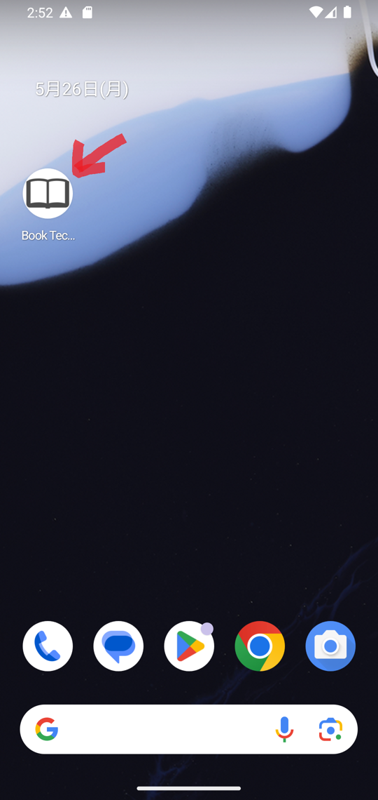

### 2-2. 本の記録を登録する

**読書の手帖**のをタップします。

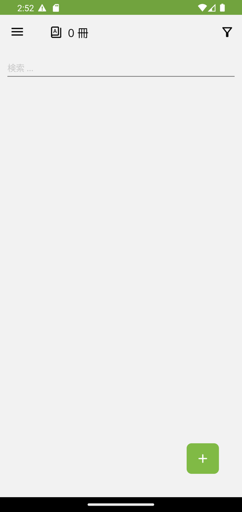

をタップすると、バーコード読み取り 、書籍のタイトルで検索 、空の記録を追加 を表示します。

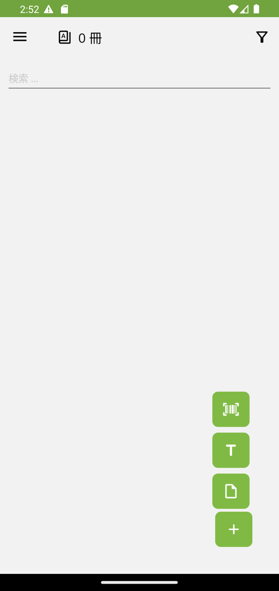

#### 2-2-1. バーコード読み取り

バーコード読み取り をタップします。

**読書の手帖**は、バーコード読み取り画面を表示します。

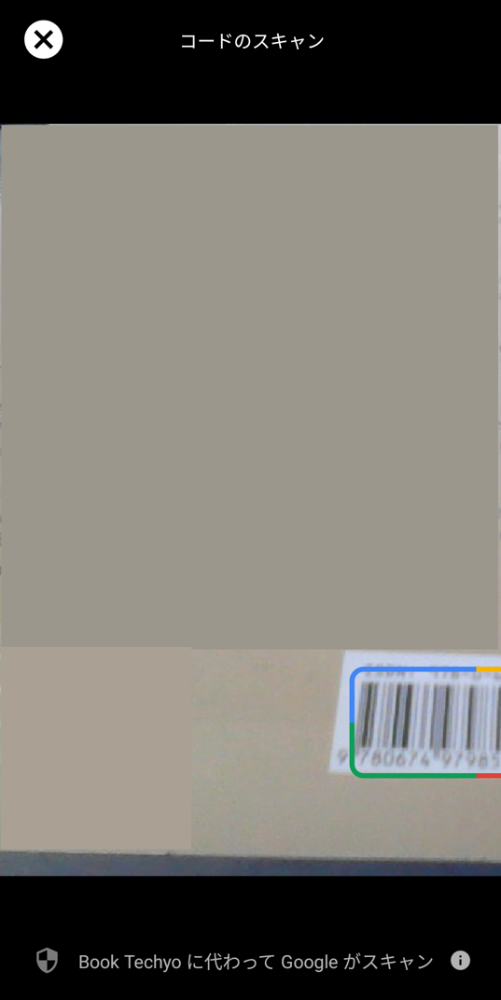

書籍のバーコード（978で始まる数学が書いてある方）をカメラにかざし、読み取りが成功するまで位置を調整してください。

<!-- TODO 許可を表示するかも -->

バーコードの読み取りに成功すると、**読書の手帖**は確認ダイアログを表示します。

正しく読み取れていたら[はい]をタップしてください。

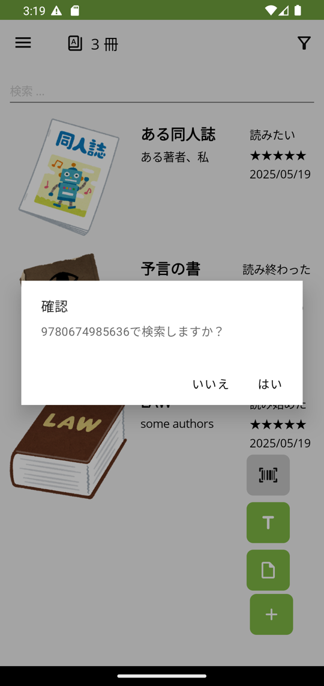

すると、**読書の手帖**は読み取ったISBNを使って検索を行い結果を表示します。

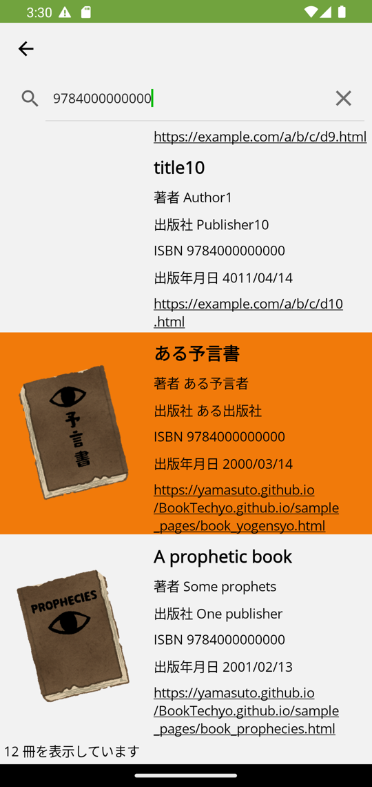

一覧で書籍を選択し、右側にスワイプしてください。すると**読書の手帖**は[選択]を表示します。

[選択]をタップすると**読書の手帖**は、本の記録を入力する詳細画面に検索結果を反映します。

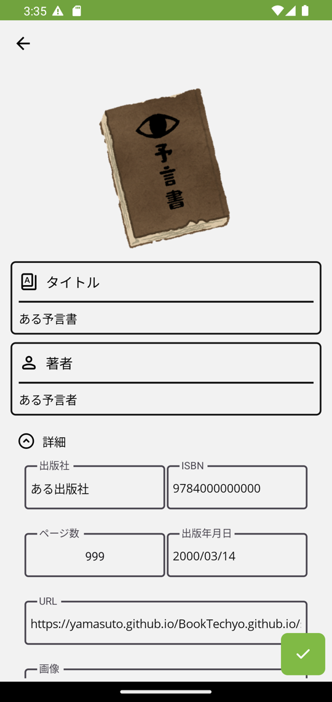

項目に入力して、をタップすると、**読書の手帖**は一覧に登録します。

#### 2-2-2. 書籍のタイトルをキーにしてインターネットを検索する

をタップします。

**読書の手帖**は、検索画面を表示します。

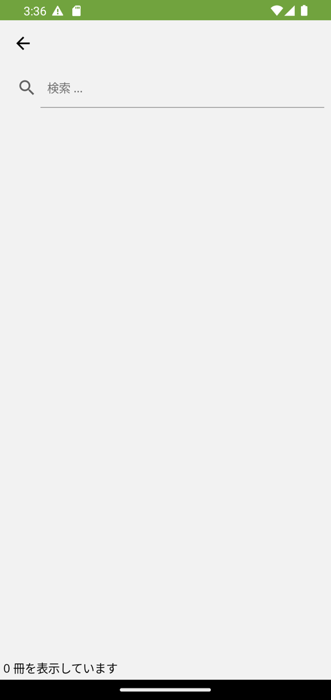

テキストボックスに検索する書籍のタイトルを入力してをタップすると、**読書の手帖**は検索を行い結果を一覧で表示します。

なお、検索で利用するサービスおよびサービスごとの検索結果の上限数は[設定画面](#3-設定)で指定します。

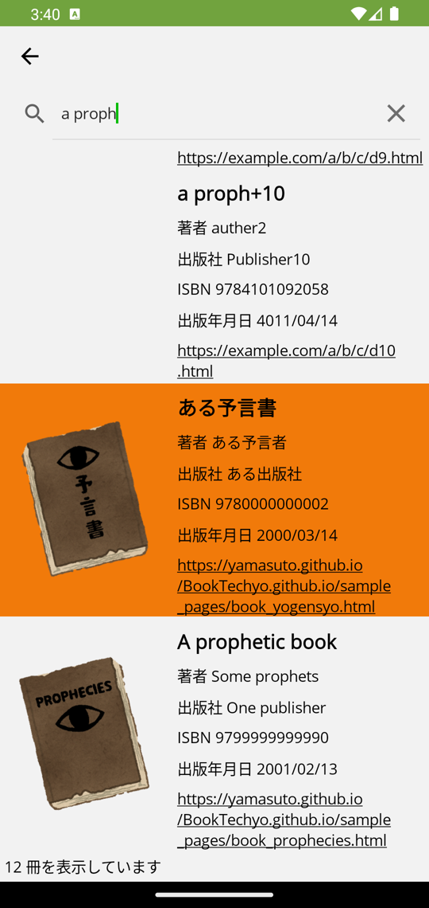

一覧で書籍を選択し、右側にスワイプしてください。すると**読書の手帖**は[選択]を表示します。

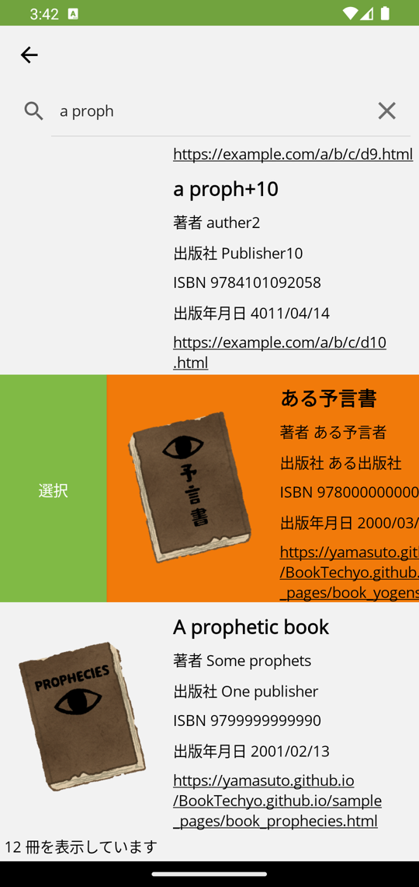

[選択]をタップすると**読書の手帖**は、本の記録を入力する詳細画面に検索結果を反映します。

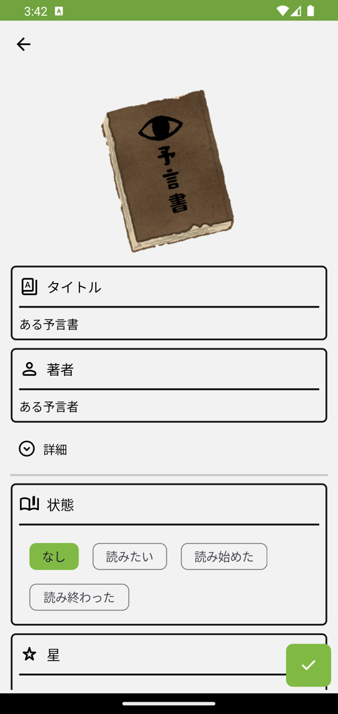

項目に入力して、をタップすると、**読書の手帖**は一覧に登録します。

#### 2-2-3. 空の記録を追加する

をタップします。

**読書の手帖**は、空の本の記録を入力する詳細画面を表示します。

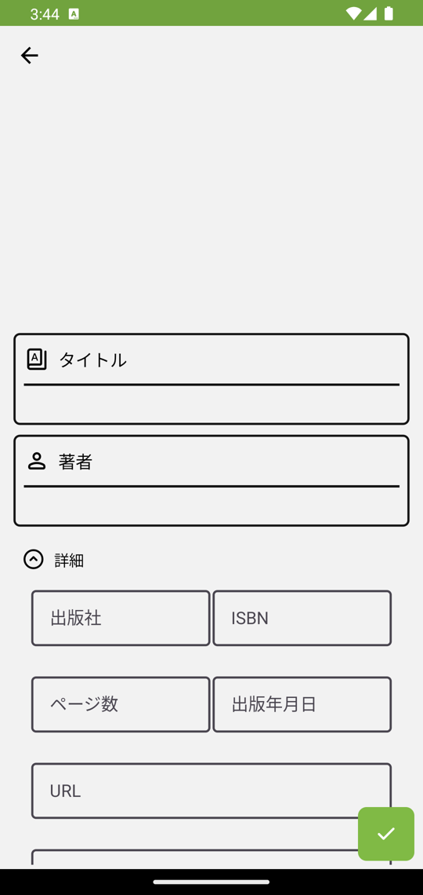

項目に入力して、をタップすると、**読書の手帖**は一覧に登録します。

### 2-3. 本の記録を編集する

**読書の手帖**で編集する記録を選択すると、本の記録を入力する詳細画面を表示します。

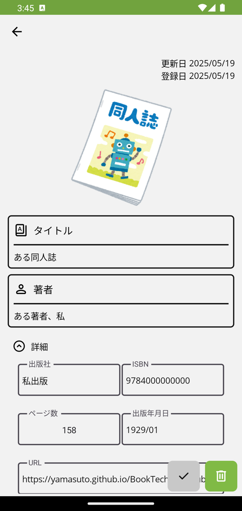

変更して、をタップします。

**読書の手帖**は、変更した内容を反映した画面を表示します。

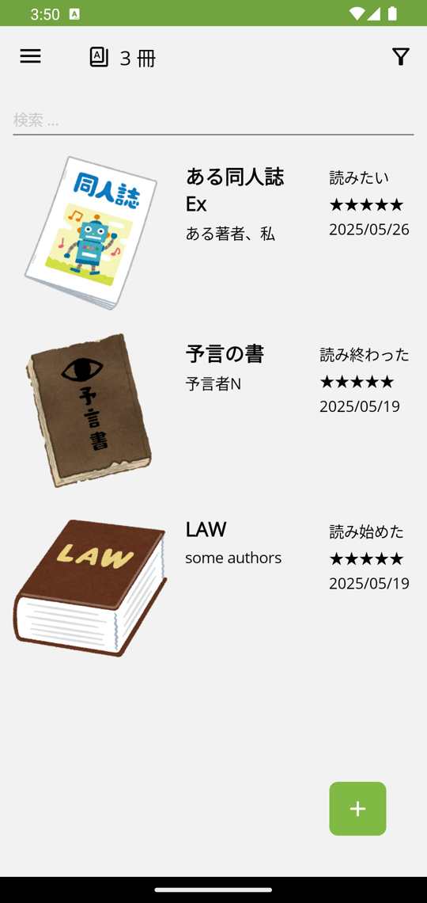

なお、詳細画面でをタップすると記録を破棄します。

### 2-4. 本の記録を検索する

文字列検索または状態を対象にして検索できます。

<!-- タグも選択できるようにしたい -->

#### 2-4-1. タイトル等を対象として検索する

タイトル、著者、説明、感想を対象として、指定した文字列を含む本の記録を検索します。

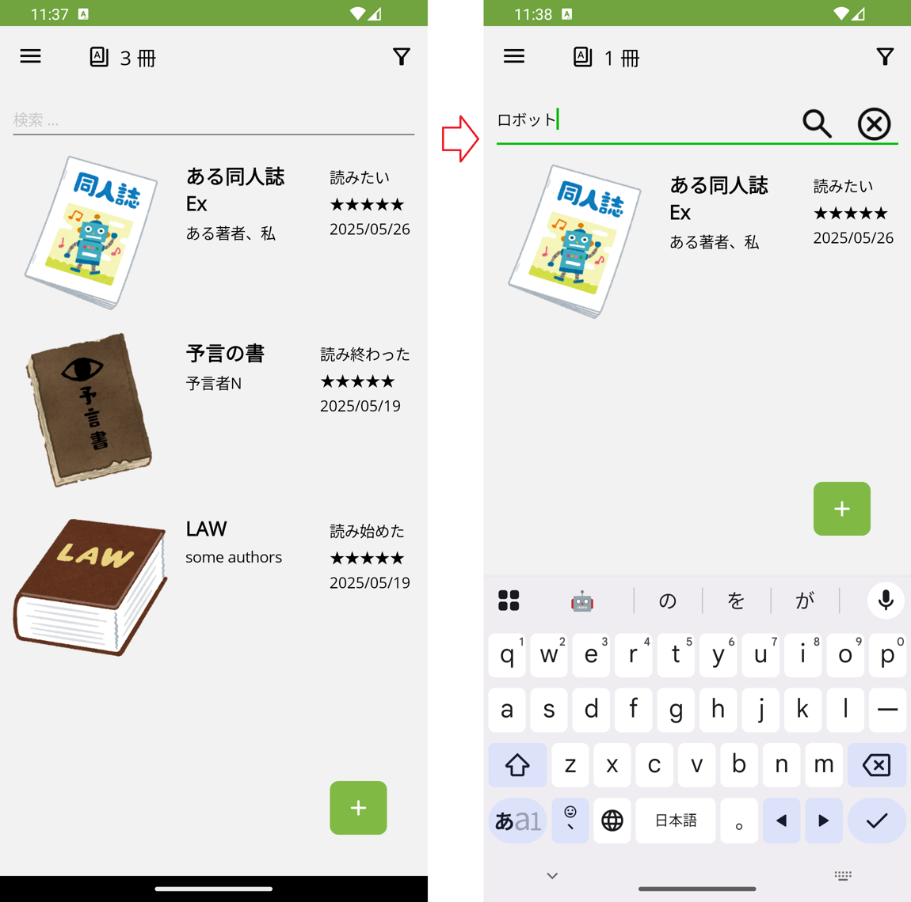

検索文字列を指定するテキストボックスに文字列を入力し、をタップします。

見つかった記録のみ一覧に表示します。

検索結果の表示をキャンセルする場合は、をタップします。

#### 2-4-2. 状態フィルター

**読書の手帖**の右上側にあるをタップすると、下側に状態フィルターを示します。

チェックありの状態だけを一覧に表示します。

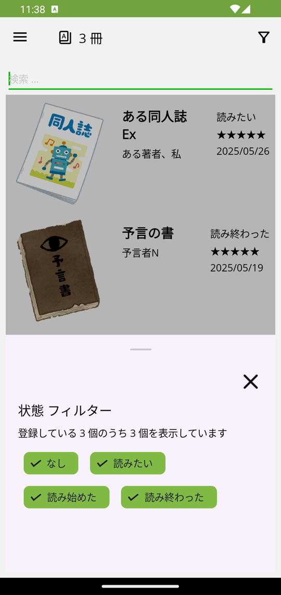

状態をタップしてチェックありなしを切り替えると、一覧に表示している本の記録を更新します。

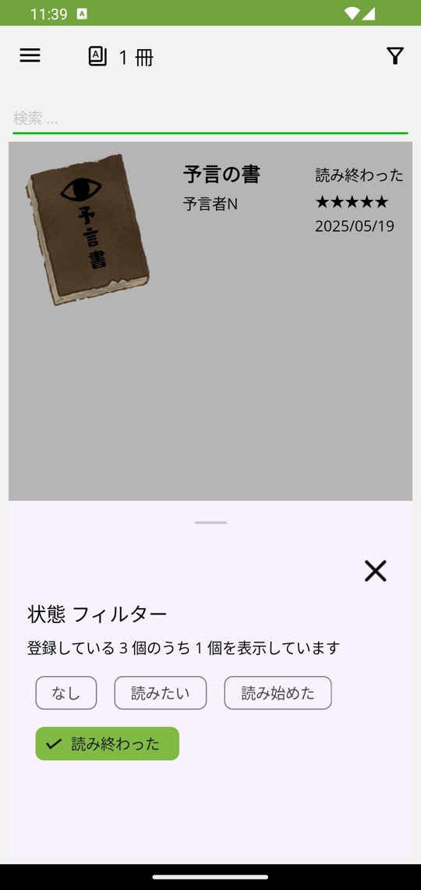

状態フィルターを閉じる場合は、右上のをタップします。

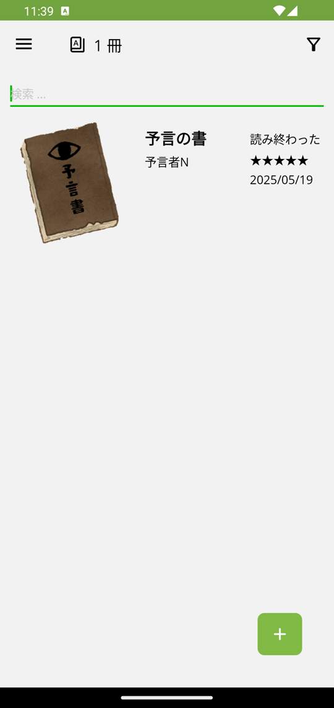

### 2-5. 読書の手帖を終了する

ホーム画面下のナビゲーションバーのボタンタップやホーム画面下から上へのスワイプにより起動中のアプリの一覧を表示します。

左右にスワイプして**読書の手帖**を選び、下から上にスワイプします。

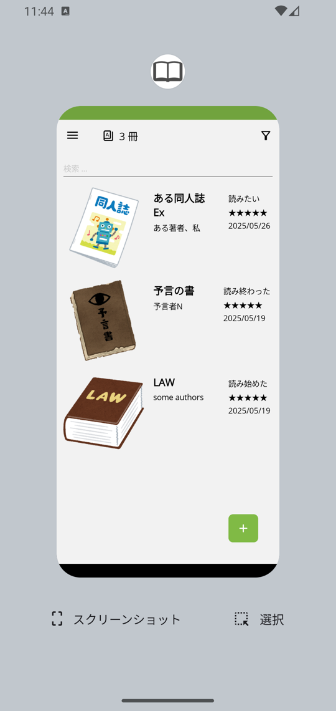

この時、**読書の手帖**は**未保存の変更を破棄します**ので注意してください。

## 3. 設定

**読書の手帖**の左上にあるをタップして、表示したメニューから[設定]をタップすると、設定画面を表示します。

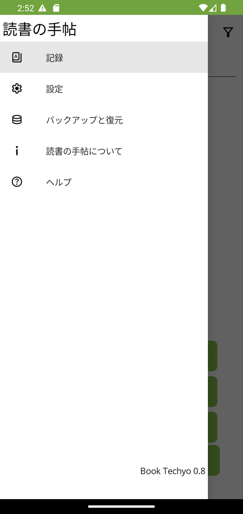

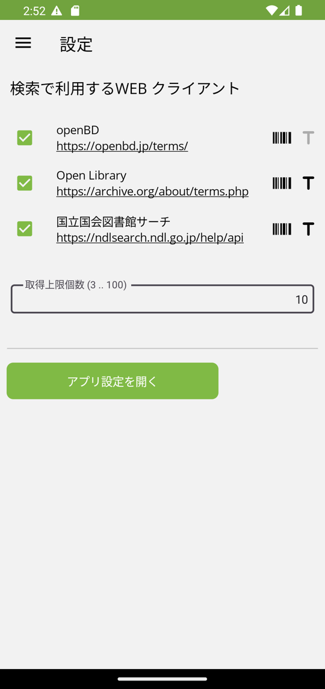

設定画面には上から

- 書籍検索サービスを利用する・しない、および優先度の指定
- 各書籍検索サービスで取得する結果の上限個数
- アプリ設定を開くボタン

があります。

### 3-1. 書籍検索サービスを利用する・しない、および優先度の指定

左側のチェックボックスにチェックがある検索サービスを使って書籍検索を行います。

全部チェックを外すと検索を行いません。

上にあるサービスから順番に検索を行います。

検索サービスの右側にがグレーでない色になっていればISBNでの検索時に利用します。がグレーでない色になっていれば書籍タイトルでの検索時に利用します。

### 3-2. 各書籍検索サービスで取得する結果の上限個数

3以上100以下の整数を指定します。

### 3-3. アプリ設定を開くボタン

タップするとアプリ設定の画面を表示します。

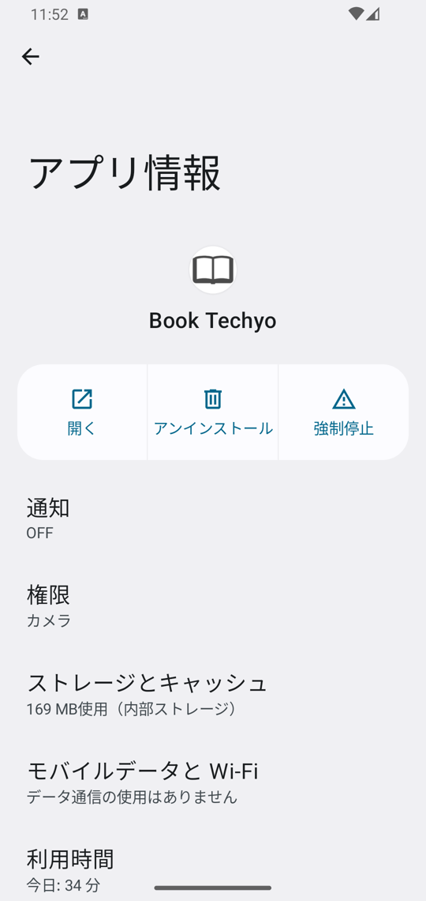

## 4. バックアップと保存

**読書の手帖**の左上にあるをタップして、表示したメニューから[バックアップと復元]をタップすると、バックアップと復元画面を表示します。

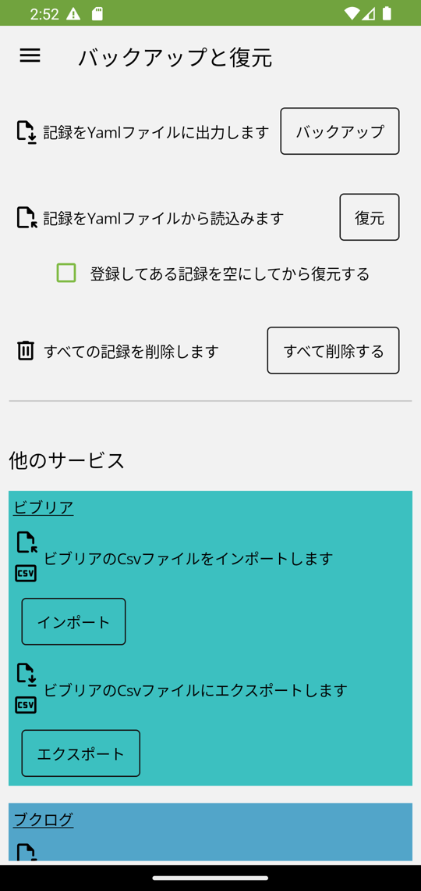

バックアップと復元画面には上から

- バックアップボタン
- 復元ボタン
- すべて削除ボタン
- 他のサービス
  - ビブリア
    - インポートボタン
    - エクスポートボタン
  - ブクログ
    - インポートボタン

があります。

### 4-1. バックアップボタン

タップすると指定したファイルに、登録した本の記録をYamlで出力します。

### 4-2. 復元ボタン

タップすると指定したファイルを読み込み本の記録を**追加**します。

既存の登録をすべて削除してから読み込む場合は、[登録してある記録を空にしてから復元する]チェックボックスをチェックしてからボタンをタップしてください。

### 4-3. すべて削除ボタン

タップすると登録している本の記録をすべて削除します。

### 4-4. 他のサービス

### 4-4-1.  ビブリア

- インポート：[読書管理ビブリア](https://biblia978.com/)のバックアップでDropboxに出力した[CSVファイル](https://biblia978.com/support/articles/15/)をインポートします。
- エクスポート：登録した本の記録を[読書管理ビブリア](https://biblia978.com/)の復元で読み込める[CSVファイル](https://biblia978.com/support/articles/15/)としてエクスポートします。

<!-- TODO confirm -->
読書管理ビブリアのバックアップは[Dropbox](https://www.dropbox.com/)にファイルを作成します。復元はDropboxにあるファイルを読み込みます。**読書の手帖**はDropboxにアクセスできないため、私はAndroidにインストールした[Dropbox](https://play.google.com/store/apps/details?id=com.dropbox.android&pcampaignid=web_share)アプリを使い以下のように操作しています。

- **読書の手帖**でインポートする
  1. 読書管理ビブリアでバックアップを行う
  2. Dropbox アプリを起動する（読書管理ビブリアでのDropboxと同じアカウント）
  3. Dropbox アプリで「Dropbox/アプリ/Biblia/books.csv」を選択してローカルに出力
  4. **読書の手帖**で、[すべて削除]を行ってのち、先に保存したCSVファイルをインポートする

- **読書の手帖**でエクスポートして、読書管理ビブリアで復元する
  1. **読書の手帖**の[ビブリア] [エクスポート]でファイル名にbooks.csvを指定して保存する
  2. Dropbox アプリで「Dropbox/アプリ/Biblia」に上のbooks.csvをアップロードする
  3. 読書管理ビブリアで「すべてのデータを削除」を行ってのち、復元を実行する

### 4-4-2. ブクログ

- インポート：ウェブ版[ブクログ](https://booklog.jp/)のエクスポートで出力した[CSVファイル](https://booklog.zendesk.com/hc/ja/articles/360048930533-%E4%BB%96%E3%81%AE%E8%AA%AD%E6%9B%B8%E7%AE%A1%E7%90%86%E3%82%B5%E3%82%A4%E3%83%88%E3%81%8B%E3%82%89%E3%83%96%E3%82%AF%E3%83%AD%E3%82%B0%E3%81%B8%E3%83%87%E3%83%BC%E3%82%BF%E3%82%92%E7%A7%BB%E8%A1%8C%E3%81%97%E3%81%9F%E3%81%84%E3%81%A7%E3%81%99)をインポートします。

---
