# 読書の手帖（Windows Store App版）

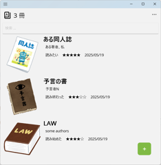

## 1. 説明

本の感想やメモを管理するアプリケーションです。

[.Net 9](https://dotnet.microsoft.com/ja-jp/)をインストールしたWindows 11[^0]やAndroid[^2]のスマートフォンで動きます。

本のバーコードをカメラで読み取って登録できます。

[読書管理ビブリア](https://biblia978.com/)で作成した記録も読み込めます。

### 1-1. 作成した理由

iPhone SE[^1]で読書管理ビブリアを使っていましたが、Google Pixel[^2]に代えたため、広告がなく無料で使えるアプリが必要になりました。

読書管理ビブリアでエクスポートしたCsvファイルを既存のアンドロイドアプリ<!-- （[Yomoo](https://play.google.com/store/apps/details?id=com.nosuke.yomoo&hl=ja)、[bondaviの記録](https://play.google.com/store/apps/details?id=jp.bondavi.likes.global&hl=ja)、[蔵書マネージャー](https://play.google.com/store/apps/details?id=com.bsy_web.bookmanager&hl=ja)、等）-->に読み込ませれば済んだのですが、以下解消したり、機能を追加すべく実装することにしました。

- 広告が煩わしい
- 不具合が直らない
- 青空文庫の本を登録したい

### 1-2. 書影データ

本アプリで提供するのメタデータの一部は、国立国会図書館サーチのAPIから取得した書誌データ（国立国会図書館が運営）に由来します。
ライセンスは[クリエイティブ・コモンズ 表示 4.0 国際 パブリック・ライセンス](https://creativecommons.org/licenses/by/4.0/legalcode.ja)です。

一部の書影画像（資料の表紙の画像）は [国立国会図書館サーチ（NDLサーチ）](https://ndlsearch.ndl.go.jp/help/api/thumbnail)により[出版情報登録センター（JPRO）](https://jpro2.jpo.or.jp/) から提供されます。

## 2. 使い方

**読書の手帖**を起動したら、本の記録を登録します。

記録が終わったら、**読書の手帖**を終了します。

### 2-1. 読書の手帖を起動する

Windowsのスタートアップ等から、**読書の手帖（Book Techyo）** をクリックして起動します。

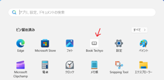

### 2-1-1. 使い始める前に

書籍検索を行う前に、[設定画面](#3-設定)にある書籍検索サービスのURLをクリックして利用規約を確認してください。同意できない場合は[チェック]を外して利用しないようにしてください。

### 2-2. 本の記録を登録する

**読書の手帖**のをクリックします。

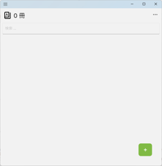

をクリックすると、バーコード読み取り 、書籍のタイトルで検索 、空の記録を追加 を表示します。

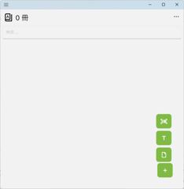

#### 2-2-1. バーコード読み取り

バーコード読み取り をクリックします。

**読書の手帖**は、バーコード読み取り画面を表示します。

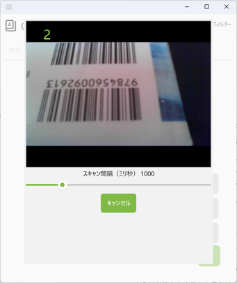

この時、カメラおよびマイクへのアクセスを許可するか確認する画面を表示することがあります。[はい]ボタンをおして許可してください。

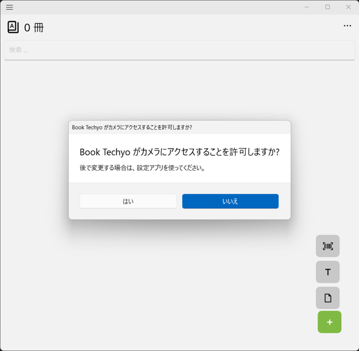

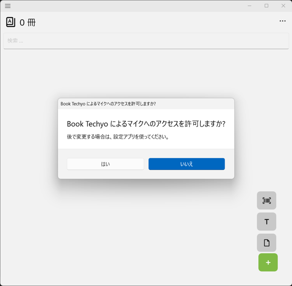

書籍のバーコード（978で始まる数学が書いてある方）をカメラにかざし、読み取りが成功するまで位置を調整してください。

カメラ画像左上の数字は読み取りを行った回数を示します。

カメラ画像の下にあるスキャン間隔を増減すると読み取りを試みる単位時間当たりの回数を変更できます。
間隔を小さくしたほうが早く読み取りに成功する可能性が増えますが、負荷が増えます。

バーコードの読み取りに成功すると、**読書の手帖**は読み取ったISBNを使って検索を行い結果を表示します。

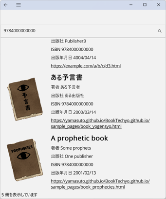

一覧で書籍を選択して **ダブルクリック**してください。

**読書の手帖**は、本の記録を入力する詳細画面に検索結果を反映します。

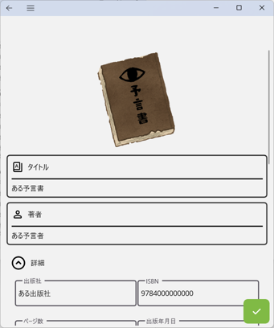

項目に入力して、をクリックすると、**読書の手帖**は一覧に登録します。

- 各項目は空、デフォルトのままにもできます。
- 感想にはシャープ（'#'）を使ってタグを設定できます。**タグ検索機能は将来対応する予定です、ごめんなさい。**

##### 2-2-1-1. バーコード読み取りの補足

- PCによっては**Windowsのカメラアプリの方が簡単にスムーズにバーコードを読み取れます**。

  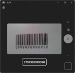

- **カメラが利用可能**であるときだけバーコード読み取りができます。PCにカメラがついてないとか、他のアプリケーションでカメラを使っているとか、そのような場合バーコード読み取りができません。

#### 2-2-2. 書籍のタイトルをキーにしてインターネットを検索する

をクリックします。

**読書の手帖**は、検索画面を表示します。

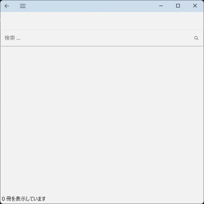

テキストボックスに検索する書籍のタイトルを入力してをクリックすると、**読書の手帖**は検索を行い結果を一覧で表示します。

- テキストボックスに書籍のタイトルを入力するとタイトルをキーにして検索します。
- ISBNを入力するとISBNをキーにして検索します（例えば9799999999990や979-9-999-99999-0）。
- 検索で利用するサービスおよびサービスごとの検索結果の上限数は[設定画面](#3-設定)で指定します。

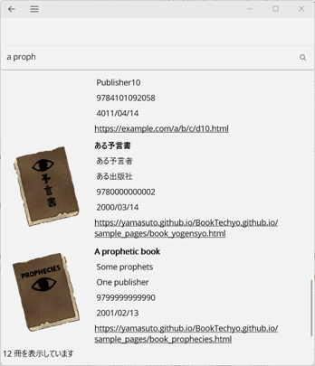

一覧で書籍を選択して **ダブルクリック**してください。

**読書の手帖**は、本の記録を入力する詳細画面に検索結果を反映します。

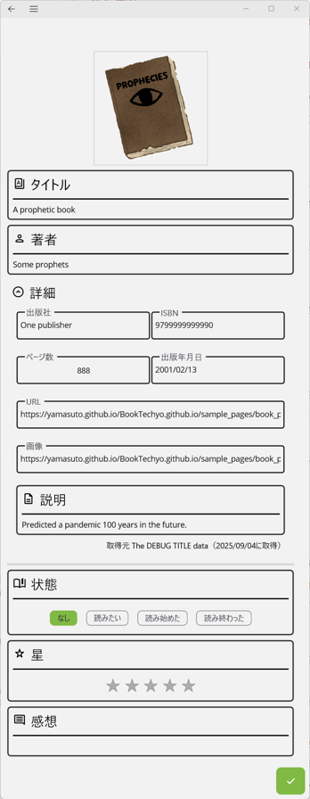

項目に入力して、をクリックすると、**読書の手帖**は一覧に登録します。

- 各項目は空、デフォルトのままにもできます。
- 感想にはシャープ（'#'）を使ってタグを設定できます。**タグ検索機能は将来対応する予定です、ごめんなさい。**

#### 2-2-3. 空の記録を追加する

をクリックします。

**読書の手帖**は、空の本の記録を入力する詳細画面を表示します。

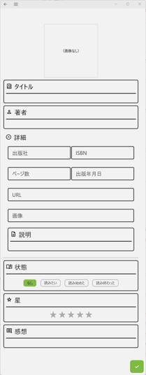

項目に入力して、をクリックすると、**読書の手帖**は一覧に登録します。

### 2-3. 本の記録を編集する

**読書の手帖**で編集する記録をダブルクリックすると、本の記録を入力する詳細画面を表示します。

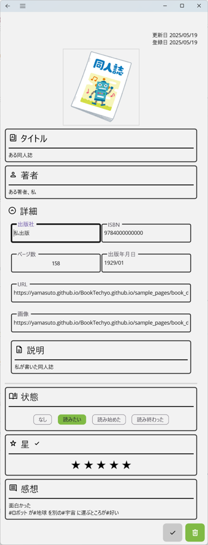

- 上部の画像は画像テキストボックスに入力したURLの画像を表示します。空のURLやアクセスできない場合は、画像を表示しません。
- 上部の画像をクリックするとURLテキストボックスに入力したURLをWEBブラウザーで表示します。
- 各項目は空、デフォルトのままにもできます。
- 感想にはシャープ（'#'）を使ってタグを設定できます。**タグ検索機能は将来対応する予定です、ごめんなさい。**

変更して、をクリックします。

**読書の手帖**は、変更した内容を反映した画面を表示します。

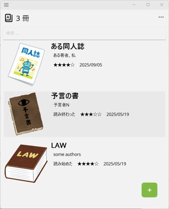

なお、詳細画面でをクリックすると記録を破棄します。

### 2-4. 本の記録を検索する

文字列検索または状態を対象にして検索できます。

<!-- タグも選択できるようにしたい -->

#### 2-4-1. タイトル等を対象として検索する

タイトル、著者、説明、感想を対象として、指定した文字列を含む本の記録を検索します。

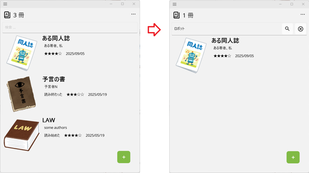

検索文字列を指定するテキストボックスに文字列を入力し、ENTERキーを押下するか、をクリックします。

見つかった記録のみ一覧に表示します。

検索結果の表示をキャンセルする場合は、をクリックします。

#### 2-4-2. 状態フィルターと並び替え

**読書の手帖**の右上側にある[・・・]をクリックして[状態フィルター]もしくは[並び替え]をクリックすると、下側に状態フィルターと並び替えの設定項目を示します。

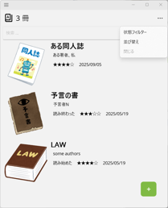

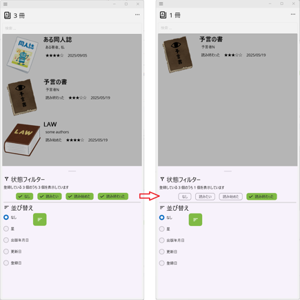

状態フィルターはチェックありの状態だけを一覧に表示します。

状態をクリックしてチェックありなしを切り替えると、一覧の表示を更新します。

並び替えで、対象と方向を選び、をクリックすると一覧に表示している本の記録を並び変えて表示します。

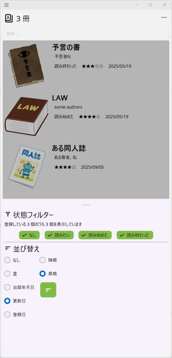

|対象|説明|
|-|-|
|なし|デフォルトの表示です。登録順に表示します。|
|星|評価の順に並び替えます|
|出版年月日|出版年月日の順に並び替えます|
|更新日|本の記録を更新した順に並び替えます|
|登録日|本の記録を登録した順に並び替えます|

|方向|説明|
|-|-|
|降順|大きい値から小さい値、もしくは新しい日付から古い日付|
|昇順|小さい値から大きい値、もしくは古い日付から新しい日付|

※[なし]を選択している場合、[方向]を表示しません。

状態フィルターと並び替えの設定項目を閉じる場合は、右上の[閉じる]をクリックするか、一覧部分をクリックします。

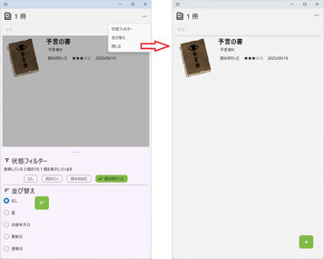

### 2-5. 読書の手帖を終了する

**読書の手帖**の右上側にあるをクリックするか、タスクバーの**読書の手帖**を右クリックして表示したメニューから[ウィンドウを閉じる]をクリックします。

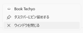

この時、**読書の手帖**は**未保存の変更を破棄します**ので注意してください。

## 3. 設定

**読書の手帖**の左上にあるをクリックして、表示したメニューから[設定]をクリックすると、設定画面を表示します。

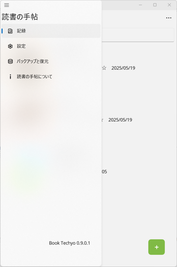

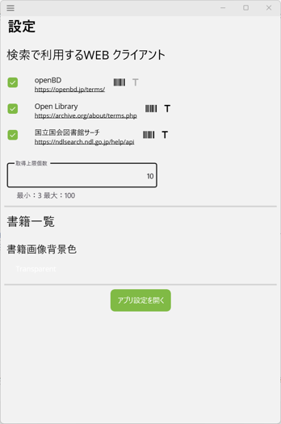

設定画面には上から以下の設定があります。

- 書籍検索サービスを利用する・しない、および優先度の指定
- 各書籍検索サービスで取得する結果の上限個数
- 書籍一覧の画像背景色指定
- アプリ設定を開くボタン

### 3-1. 書籍検索サービスを利用する・しない、および優先度の指定

**検索を行う前に書籍検索サービスのURLをクリックして利用規約を確認してください。同意できない場合は[チェック]を外して利用しないようにしてください。**

左側のチェックボックスにチェックがある検索サービスを使って書籍検索を行います。

全部チェックを外すと検索を行いません。

上にあるサービスから順番に検索を行います。

検索サービスの右側にがグレーでない色になっていればISBNでの検索時に利用します。がグレーでない色になっていれば書籍タイトルでの検索時に利用します。

|サービス|ホームページ|説明|
|-|-|-|
|openDB|<https://openbd.jp/>|ISBNで検索|
|Open Library|<https://openlibrary.org/>|ISBNおよびタイトルで検索|
|国立国会図書館サーチ|<https://ndlsearch.ndl.go.jp/>|ISBNおよびタイトルで検索|

### 3-2. 各書籍検索サービスで取得する結果の上限個数

3以上100以下の整数を指定します。

### 3-3. 書籍の画像背景色指定

書籍の画像の背景色を指定します。デフォルトは透明です。

### 3-4. アプリ設定を開くボタン

クリックするとアプリ設定の画面を表示します。

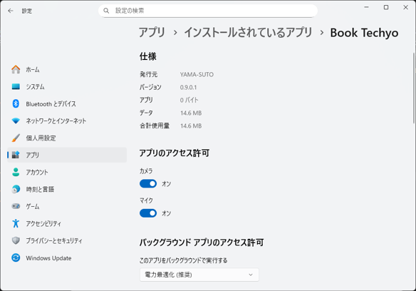

## 4. バックアップと保存

**読書の手帖**の左上にあるをクリックして、表示したメニューから[バックアップと復元]をクリックすると、バックアップと復元画面を表示します。

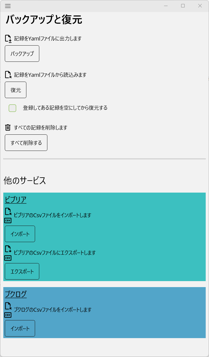

バックアップと復元画面には上から、以下の項目があります。

- バックアップボタン
- 復元ボタン
- すべて削除ボタン
- 他のサービス

### 4-1. バックアップボタン

クリックすると指定したファイルに、登録した本の記録をYamlファイルに出力します。

- YamlファイルはWindowsのメモ帳などテキストエディターで開いて編集することもできます。編集する場合は書式や文字コード、改行コードが変わらないように気を付けて保存してください。
- Yamlファイルの文字コードはUTF-8（BOMなし）、改行コードはCRLFです。

### 4-2. 復元ボタン

クリックすると指定したファイルを読み込み本の記録を**追加**します。

既存の登録をすべて削除してから読み込む場合は、[登録してある記録を空にしてから復元する]チェックボックスをチェックしてからボタンをクリックしてください。

### 4-3. すべて削除ボタン

クリックすると登録している本の記録をすべて削除します。

### 4-4. 他のサービス

### 4-4-1. 読書管理ビブリア

- インポート：[読書管理ビブリア](https://biblia978.com/)のバックアップでDropbox[^3]に出力した[CSVファイル](https://biblia978.com/support/articles/15/)をインポートします。
- エクスポート：登録した本の記録を[読書管理ビブリア](https://biblia978.com/)の復元で読み込める[CSVファイル](https://biblia978.com/support/articles/15/)としてエクスポートします。

読書管理ビブリアのバックアップは[Dropbox](https://www.dropbox.com/)にファイルを作成します。**読書の手帖**はDropboxにアクセスできないため、私はWindowsにインストールした[Dropbox Lite](https://apps.microsoft.com/detail/9WZDNCRFJ0PK?hl=ja&gl=JP&ocid=pdpshare)アプリを使い以下のように操作してインポートやエクスポートをしています。

- **読書の手帖**でインポートする
  1. 読書管理ビブリアでバックアップを行う
  2. Dropbox Liteを起動する（読書管理ビブリアでのDropboxと同じアカウントで）
  3. Dropbox Liteで「Dropbox/アプリ/Biblia/books.csv」を選択して「名前をつけて保存」でWindowsのローカルフォルダー（ドキュメントフォルダー等）に出力する
  4. **読書の手帖**で、[すべて削除]を行ってのち、先に保存したCSVファイルをインポートする

- **読書の手帖**でエクスポートして、読書管理ビブリアで復元する
  1. **読書の手帖**の[ビブリア] [エクスポート]でファイル名にbooks.csvを指定して保存する
  2. Dropbox Liteで「Dropbox/アプリ/Biblia」に上のbooks.csvをアップロードする
  3. 読書管理ビブリアで「すべてのデータを削除」を行ってのち、復元を実行する

<!-- ### 4-4-2. ブクログ

- インポート：ウェブ版[ブクログ](https://booklog.jp/)のエクスポートで出力した[CSVファイル](https://booklog.zendesk.com/hc/ja/articles/360048930533-%E4%BB%96%E3%81%AE%E8%AA%AD%E6%9B%B8%E7%AE%A1%E7%90%86%E3%82%B5%E3%82%A4%E3%83%88%E3%81%8B%E3%82%89%E3%83%96%E3%82%AF%E3%83%AD%E3%82%B0%E3%81%B8%E3%83%87%E3%83%BC%E3%82%BF%E3%82%92%E7%A7%BB%E8%A1%8C%E3%81%97%E3%81%9F%E3%81%84%E3%81%A7%E3%81%99)をインポートします。

※ エクスポート機能はありません。 -->

## 5. 読書の手帖について

**読書の手帖**の左上にあるをクリックして、表示したメニューから[読書の手帖について]をクリックすると、読書の手帖について画面を表示します。

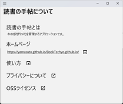

上からそれぞれ、ホームページ、使い方、プライバシーについて、OSSライセンスを表示します。

## 6. お問い合わせ

本アプリに関するご質問やご不明点がございましたら、[ホームページからお問い合わせ](https://yamasuto.github.io/BookTechyo.github.io/contact/ja-JP/)ください。

---

[^0]: Windows及び関連する名称並びにそれぞれのロゴは、米国Microsoft Corporationの米国およびその他の国における登録商標です。
[^1]: iPhoneはApple inc.の登録商標です。iPhone商標は、アイホン株式会社のライセンスに基づき使用されています。
[^2]: 「Google」「Google Pixel」「Android」は、Google LLCの商標または登録商標です。
[^3]: DropboxおよびDropboxのロゴはDropbox, Inc.の商標です。
