# 読書の手帖（Windows Store App版）

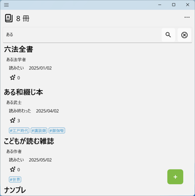

目次

- [読書の手帖（Windows Store App版）](#読書の手帖windows-store-app版)
  - [1. 説明](#1-説明)
    - [1-1. 作成した理由](#1-1-作成した理由)
    - [1-2. 書誌・書影](#1-2-書誌書影)
    - [1-3. プライバシーポリシー](#1-3-プライバシーポリシー)
    - [1-4. 必要なソフトウェア](#1-4-必要なソフトウェア)
  - [2. 使い方](#2-使い方)
    - [2-1. 読書の手帖を起動する](#2-1-読書の手帖を起動する)
    - [2-2. 使い始める前に](#2-2-使い始める前に)
    - [2-3. 本の記録を登録する](#2-3-本の記録を登録する)
    - [2-4. 読書の手帖を終了する](#2-4-読書の手帖を終了する)
  - [3. メニュー](#3-メニュー)
    - [3-1. 記録](#3-1-記録)
      - [3-1-1. 本の記録を登録する](#3-1-1-本の記録を登録する)
      - [3-1-1-1. バーコード読み取り](#3-1-1-1-バーコード読み取り)
        - [3-1-1-1-A. バーコード読み取りの補足](#3-1-1-1-a-バーコード読み取りの補足)
      - [3-1-1-2. 書籍のタイトルでインターネットを検索する](#3-1-1-2-書籍のタイトルでインターネットを検索する)
      - [3-1-1-3. 空の記録を追加する](#3-1-1-3-空の記録を追加する)
      - [3-1-2. 本の記録を記入・編集・削除する](#3-1-2-本の記録を記入編集削除する)
      - [3-1-2-1. 賞](#3-1-2-1-賞)
      - [3-1-3. 本の記録を検索する・並び替える](#3-1-3-本の記録を検索する並び替える)
        - [3-1-3-1. タイトル等を対象として検索する](#3-1-3-1-タイトル等を対象として検索する)
        - [3-1-3-2. フィルターと並び替え](#3-1-3-2-フィルターと並び替え)
    - [3-2. グラフ](#3-2-グラフ)
    - [3-3. 設定](#3-3-設定)
      - [3-3-1. 書籍検索サービスを利用する・しない、および優先度の指定](#3-3-1-書籍検索サービスを利用するしないおよび優先度の指定)
      - [3-3-2. 各書籍検索サービスで取得する結果の上限個数](#3-3-2-各書籍検索サービスで取得する結果の上限個数)
      - [3-3-3. 書籍の画像を表示するかどうか](#3-3-3-書籍の画像を表示するかどうか)
      - [3-3-4. 書籍の画像背景色指定](#3-3-4-書籍の画像背景色指定)
      - [3-3-5. クリップボードから読み取る](#3-3-5-クリップボードから読み取る)
      - [3-3-6. アプリ設定を開くボタン](#3-3-6-アプリ設定を開くボタン)
    - [3-4. バックアップと保存](#3-4-バックアップと保存)
      - [3-4-1. バックアップボタン](#3-4-1-バックアップボタン)
      - [3-4-2. 復元ボタン](#3-4-2-復元ボタン)
      - [3-4-3. すべて削除ボタン](#3-4-3-すべて削除ボタン)
      - [3-4-4. 他のサービス](#3-4-4-他のサービス)
        - [3-4-4-1. 読書管理ビブリア](#3-4-4-1-読書管理ビブリア)
    - [3-5. 読書の手帖について](#3-5-読書の手帖について)
  - [4. お問い合わせ](#4-お問い合わせ)

## 1. 説明

本の感想やメモを管理するアプリケーションです。

Windows 11[^0]のPCやAndroid[^2]のスマートフォンで動きます。

本のバーコードをカメラで読み取って登録できます。

[読書管理ビブリア](https://biblia978.com/)で作成した記録も読み込めます。

### 1-1. 作成した理由

iPhone SE[^1]で[読書管理ビブリア](https://biblia978.com/)を使っていましたが、Google Pixel[^2]にかえたため、広告がなく無料で使えるアプリが必要になりました。

読書管理ビブリアでエクスポートしたCsvファイルを既存のアンドロイドアプリに読み込ませれば済んだのですが、以下解消したり、機能を追加すべく実装することにしました。

- 広告が煩わしい
- 不具合が直らない
- [青空文庫](https://www.aozora.gr.jp/)の本を登録したい

### 1-2. 書誌・書影

本アプリで提供するのメタデータの一部は、国立国会図書館サーチのAPIから取得した書誌データ（国立国会図書館が運営）に由来します。
ライセンスは[クリエイティブ・コモンズ 表示 4.0 国際 パブリック・ライセンス](https://creativecommons.org/licenses/by/4.0/legalcode.ja)です。

なお、**読書の手帖**は、書影画像（資料の表紙の画像）を取得しません（書影提供元に確認しましたが確認できなかったためです）。

- 国立国会図書館サーチ [書影APIのサービス終了について（2026年3月31日（火））](https://ndlsearch.ndl.go.jp/news/20251217)

### 1-3. プライバシーポリシー

本アプリの[プライバシーポリシー](./PrivacyPolicy.jaJP)

### 1-4. 必要なソフトウェア

**.NET 9.0 ランタイム**が必要です。PCにインストールしていない場合は、<https://dotnet.microsoft.com/download>から **.NET 9.0ランタイム** をダウンロードしてインストールしてください。

## 2. 使い方

**読書の手帖**を起動したら、本の記録登録など操作します。

使い終わったら、**読書の手帖**を終了します。

### 2-1. 読書の手帖を起動する

Windowsのスタートアップ等から、**読書の手帖（Book Techyo）** をクリックして起動します。

### 2-2. 使い始める前に

アプリインストール後の初回起動時に、書籍検索サービスの利用規約確認をお願いするメッセージを表示します。

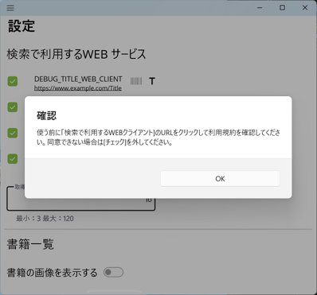

OKボタンをクリックしてメッセージを閉じ、[設定画面](#3-3-設定)にある書籍検索サービスのURLをクリックして利用規約を確認してください。同意できない場合は[チェック]を外して利用しないようにしてください。

### 2-3. 本の記録を登録する

個々に登録する、もしくはファイルを読み込んでまとめて登録します。

- 個々に登録する場合
  - 本のタイトルで検索して登録できます。
  - カメラで読み込んだISBNで検索して登録できます。
  - [国立国会図書館サーチ](https://ndlsearch.ndl.go.jp/)で本を検索して、見つかった本のページにある「引用文（参考文献注）を生成」をクリックして、「記載例をコピー」をクリックすると引用文をもとにして登録できます。
- ファイルを読み込んでまとめて登録する場合は、バックアップで作成したYaml形式のファイルか読書管理ビブリアでエクスポートしたCsvファイルを使います。

### 2-4. 読書の手帖を終了する

**読書の手帖**の右上側にあるをクリックするか、タスクバーの**読書の手帖**を右クリックして表示したメニューから[ウィンドウを閉じる]をクリックします。

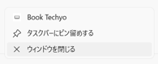

この時、**読書の手帖**は**反映していない変更を破棄します**ので注意してください。

## 3. メニュー

**読書の手帖**の左上にあるをクリックするとメニューを表示します。

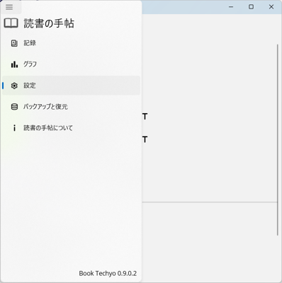

### 3-1. 記録

本の記録を一覧表示します。

本の記録にはタイトル、著者、状態、更新日、星の数、賞の有無、タグを表示します。

#### 3-1-1. 本の記録を登録する

**読書の手帖**のをクリックします。

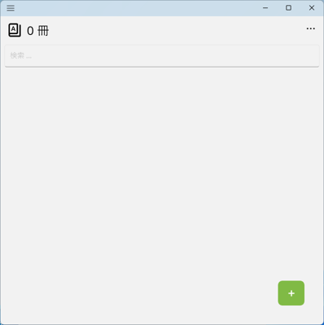

をクリックすると、バーコード読み取り 、書籍のタイトルで検索 、空の記録を追加 を表示します。

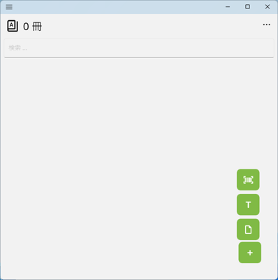

他のアプリでISBNや解析可能な書籍の説明をコピーした場合には、上に加えて読み取る を表示します。

- 他のアプリでISBNをコピーした場合に、をクリックすると**読書の手帖**はコピーしたISBNを使って検索を行い結果を表示します。
- [国立国会図書館サーチ](https://ndlsearch.ndl.go.jp/)で本を検索して、見つかった本のページにある「引用文（参考文献注）を生成」をクリックして、「記載例をコピー」をクリックした場合に、をクリックすると**読書の手帖**は、引用文をもとに詳細ページに表示します。

なお、上の機能は[設定画面](#3-3-設定)の[クリップボードから読み取る]でオンとオフを切り替えられます。

#### 3-1-1-1. バーコード読み取り

バーコード読み取り をクリックします。

**読書の手帖**は、バーコード読み取り画面を表示します。

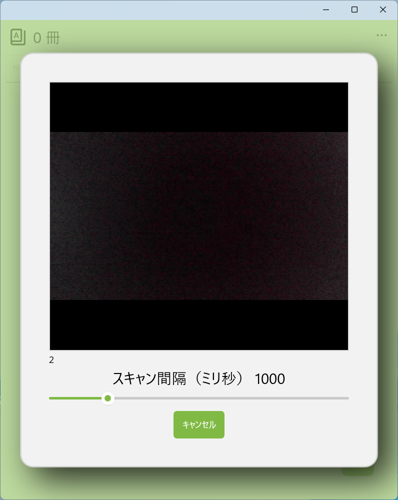

この時、カメラおよびマイクへのアクセスを許可するか確認する画面を表示することがあります。[はい]ボタンをクリックして許可してください。

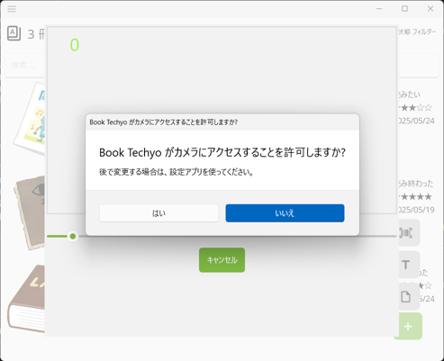

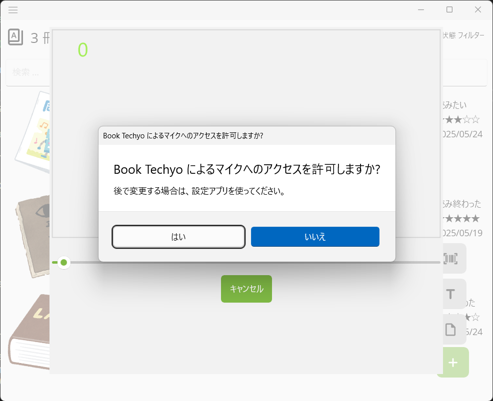

書籍のバーコード（978で始まる数学が書いてある方）をカメラにかざし、読み取りが成功するまで位置を調整してください。

カメラ画像左下の数字は読み取りを行った回数を示します。

カメラ画像の下にあるスキャン間隔を増減すると読み取りを試みる単位時間当たりの回数を変更できます。
間隔を小さくしたほうが早く読み取りに成功する可能性が増えますが、負荷が増えます。

バーコードの読み取りに成功すると、**読書の手帖**は読み取ったISBNを使って検索を行い結果を表示します。

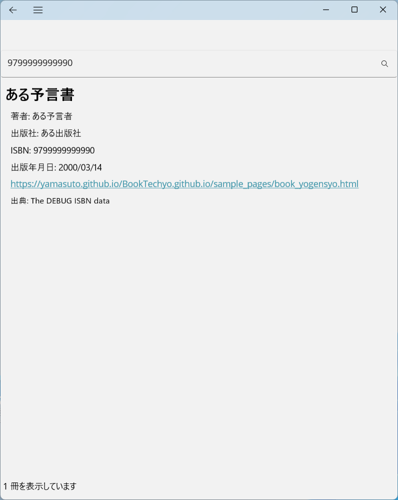

一覧で書籍を選択して **ダブルクリック**してください。

**読書の手帖**は、本の記録を入力する[詳細画面](#3-1-2-本の記録を記入編集削除する)に検索結果を反映します。

項目に入力して、をクリックすると、**読書の手帖**は一覧に登録します。

##### 3-1-1-1-A. バーコード読み取りの補足

- PCによっては**Windowsのカメラアプリの方が簡単にスムーズにバーコードを読み取れます**。

  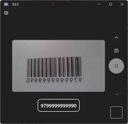

  **Windowsのカメラアプリ**でISBNを読み取った場合には、**読書の手帖**はを表示します。クリックすると読み取ったISBNを使って検索を行い結果を表示します。

  

  なお、コピーしたISBNで検索する機能は[設定画面](#3-3-設定)でオンとオフを切り替えられます。

- **カメラが利用可能**であるときだけバーコード読み取りができます。PCにカメラがついてないとか、他のアプリケーションでカメラを使っているとか、そのような場合バーコード読み取りができません。

#### 3-1-1-2. 書籍のタイトルでインターネットを検索する

をクリックします。

**読書の手帖**は、検索画面を表示します。

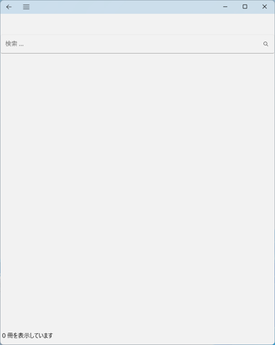

テキストボックスに検索する書籍のタイトルを入力してをクリックすると、**読書の手帖**は検索を行い結果を一覧で表示します。

- テキストボックスに書籍のタイトルを入力するとタイトルをキーにして検索します。
- テキストボックスにISBNを入力するとISBNをキーにして検索します（例えば`9799999999990`や`979-9-999-99999-0`）。
- テキストボックスにtitle: (書籍タイトル) author: (書籍著者名)と指定するとタイトルと著者名で検索します。
  - 例えば`title: 草枕 author: 夏目漱石`です。
  - タイトルだけ、著者名だけでも検索できます。
  - 青空文庫で著者の書籍一覧を取得したい場合は、author: (書籍著者名)と入力します。
- 検索で利用するサービスおよびサービスごとの検索結果の上限数は[設定画面](#3-3- 設定)で指定します。

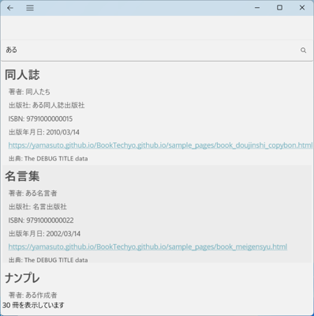

一覧で書籍を選択して **ダブルクリック**してください。

**読書の手帖**は、本の記録を入力する[詳細画面](#3-1-2-本の記録を記入編集削除する)に検索結果を反映します。

項目に入力して、をクリックすると、**読書の手帖**は一覧に登録します。

#### 3-1-1-3. 空の記録を追加する

をクリックします。

**読書の手帖**は、空の本の記録を入力する[詳細画面](#3-1-2-本の記録を記入編集削除する)を表示します。

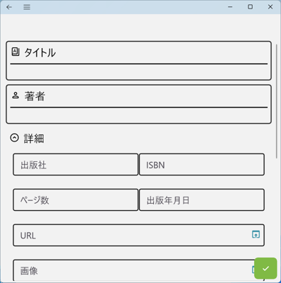

項目に入力して、をクリックすると、**読書の手帖**は一覧に登録します。

#### 3-1-2. 本の記録を記入・編集・削除する

**読書の手帖**で本の記録を新規登録したり、登録してある本の記録をダブルクリックすると、[詳細画面](#3-1-2-本の記録を記入編集削除する)を表示します。

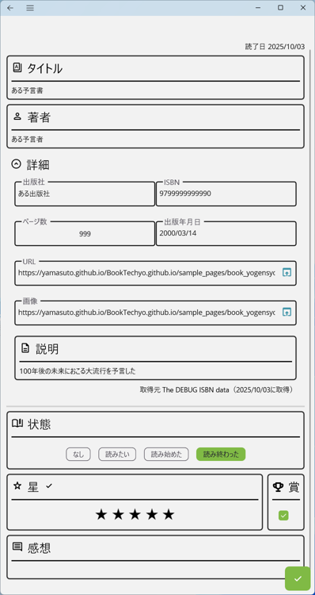

- 各項目は空、デフォルトのままにもできます。
-  詳細をクリックすると、エクスパンダー（出版社、ISBN、ページ数、出版年月日、URL、画像、説明、出典を内包する）を展開して表示します。をクリックすると、エクスパンダーを畳み非表示にします。

タイトルおよび著者をクリックするとPopupを表示します。タイトル、著者を指定して[OK]をクリックしてください。

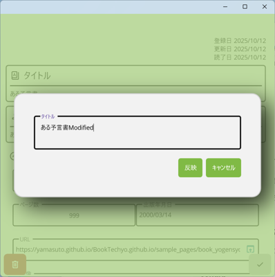

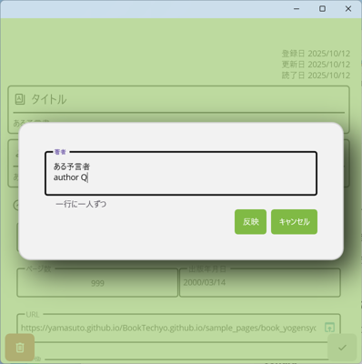

説明および感想をクリックすると、それぞれ入力ページを表示します。

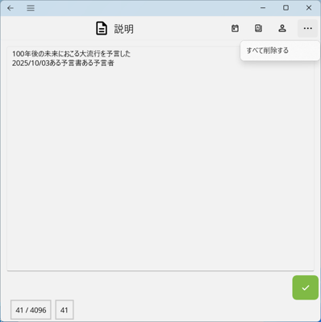

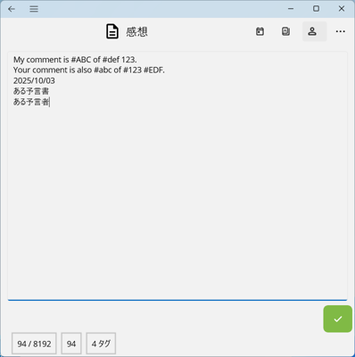

- 画面右上のツールバーで[今日の日付]、[タイトル]、[著者名]を入力できます。
- 感想にはシャープ（'#'）を使ってタグを設定できます。後々タグで検索できます。

変更して、をクリックします。

**読書の手帖**は、変更した内容を反映した画面を表示します。

変更を破棄して元の表示に戻るには、画面左上のをクリックします。

なお、登録してある本の記録をダブルクリックして[詳細画面](#3-1-2-本の記録を記入編集削除する)を表示した場合には、をクリックすると記録を**削除**します。

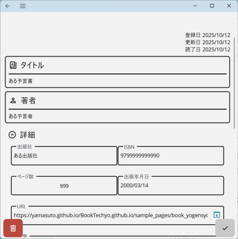

#### 3-1-2-1. 賞

賞は、一年で一番面白かった本を指定するために作りました。

- 他の項目（[状態]や[星]など）と関係なく、チェックありなしを切り替えられます。
- [賞]にチェックすると一覧でもを表示します。
- [賞]ありなしを指定して検索できます。

#### 3-1-3. 本の記録を検索する・並び替える

登録してある本の記録を文字列または状態を対象にして検索できます。日付順等で並び替えられます。

##### 3-1-3-1. タイトル等を対象として検索する

タイトル、著者、出版社、説明、感想を対象として、指定した文字列を含む本の記録を検索します。

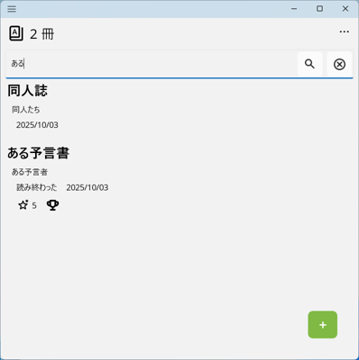

検索文字列を指定するテキストボックスに文字列を入力し、ENTERキーを押下するか、をクリックします。

見つかった本の記録のみ一覧に表示します。

検索結果の表示をキャンセルする場合は、をクリックします。

- 検索文字列を指定するテキストボックスに、項目名と検索する文字列を入力すると指定の項目のみを対象として検索します。例えば`title: 探す本のタイトル`です。
  - 指定できる項目名はtitle、authors、publisher、memo、comment、tagです。それぞれタイトル、著者、出版社、説明、感想、タグだけを対象として検索します。
  - 指定できる項目名は一つだけです。

##### 3-1-3-2. フィルターと並び替え

右上のをクリックすると、フィルターと並び替えのメニューを表示します。

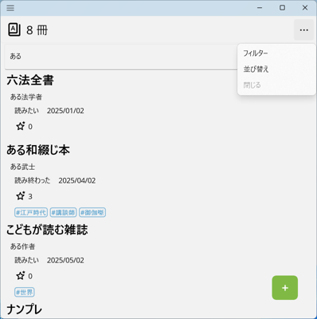

[状態]では**チェックあり**の状態だけを一覧に表示します。クリックしてチェックありなしを切り替えると、一覧の表示を更新します。

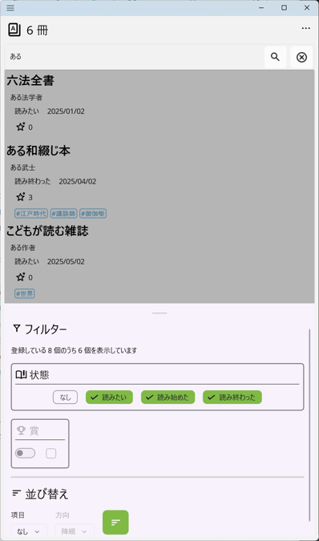

[賞]は左側の[スイッチ]でオンにしてから、賞の有り無しを[チェックボックス]で指定します。チェックありなしを切り替えると、一覧の表示を更新します。

[並び替え]で、対象と方向を選び、をクリックすると一覧に表示している本の記録を並び変えて表示します。

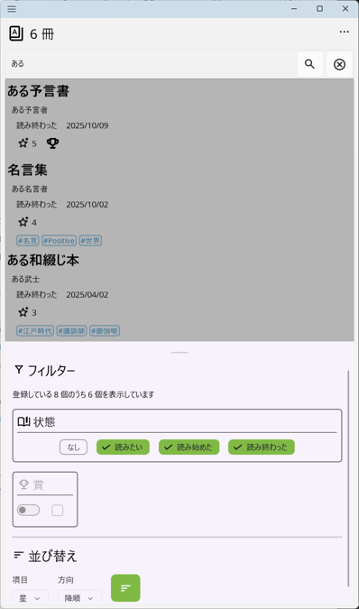

対象

|対象|説明|
|-|-|
|なし|デフォルトの表示です。登録順に表示します。|
|星|評価の順に並び替えます|
|出版年月日|出版年月日の順に並び替えます|
|更新日|本の記録を**更新**した順に並び替えます|
|登録日|本の記録を**登録**した順に並び替えます|

方向

|方向|説明|
|-|-|
|降順|大きい値から小さい値、もしくは新しい日付から古い日付|
|昇順|小さい値から大きい値、もしくは古い日付から新しい日付|

※[なし]を選択している場合、[方向]を表示しません。

フィルターと並び替えの設定項目を閉じる場合は、右上メニューの[閉じる]をクリックするか、一覧部分をクリックします。

### 3-2. グラフ

表示したメニューから[グラフ]をクリックすると、グラフ画面を表示します。

選択した年に更新した本の記録の数を状態毎に棒グラフで表示します。

グラフの下に一年間に読み終わった本の合計、[賞]を設定した本の合計を表示します。

### 3-3. 設定

表示したメニューから[設定]をクリックすると、設定画面を表示します。

設定画面には上から以下の設定があります。

- 書籍検索サービスを利用する・しない、および優先度の指定
- 各書籍検索サービスで取得する結果の上限個数
- 書籍一覧等で書影を表示するかどうか
- 書籍一覧等の書影背景色指定
- クリップボードから読み取る
- アプリ設定を開くボタン

<!-- なお、画像中の`DEBUG_TITLE_WEB_CLIENT`と`DEBUG_ISBN_WEB_CLIENT`は開発用のWEBサービスです。アプリストアから取得した**読書の手帖**では表示しません。 -->

#### 3-3-1. 書籍検索サービスを利用する・しない、および優先度の指定

**検索を行う前に書籍検索サービスのURLをクリックして利用規約を確認してください。同意できない場合は[チェック]を外して利用しないようにしてください。**

左側のチェックボックスにチェックがある検索サービスを使って書籍検索を行います。

全部チェックを外すと検索を行いません。

上にあるサービスから順番に検索を行います。

検索サービスの右側にがグレーでない色になっていればISBNでの検索時に利用します。がグレーでない色になっていれば書籍タイトルでの検索時に利用します。

|サービス|ホームページ|説明|
|-|-|-|
|国立国会図書館サーチ|<https://ndlsearch.ndl.go.jp/>|ISBNおよびタイトルで検索|
|青空文庫・国立国会図書館サーチ|<https://ndlsearch.ndl.go.jp/>|タイトルで検索|

- 青空文庫・国立国会図書館サーチは国立国会図書館サーチでデータプロバイダーに青空文庫（リポジトリ番号 R000000014）を指定して検索を実施しています。国立国会図書館サーチでの青空文庫データ更新頻度は[月1回](https://ndlsearch.ndl.go.jp/help/target)です。

#### 3-3-2. 各書籍検索サービスで取得する結果の上限個数

3以上120以下の整数を指定します。

#### 3-3-3. 書籍の画像を表示するかどうか

一覧等で書籍の画像を表示するかどうかを指定します。デフォルトは非表示です。

以下は画像を表示をするとした場合（さらに背景色を変更しています）の一覧表示です。

#### 3-3-4. 書籍の画像背景色指定

書籍の画像の背景色を指定します。デフォルトは透明です。

ボタンをクリックすると背景色選択を行う画面を表示します。

#### 3-3-5. クリップボードから読み取る

他のアプリでISBNや解析可能な書籍の説明をコピーした場合に、クリップボードから読み取るかどうかを指定します。デフォルトはオン、読み取るです。

以下読み取りできます。

- ISBN
- [国立国会図書館サーチ](https://ndlsearch.ndl.go.jp/)の「引用文（参考文献注）を生成」による「記載例」

オンにした場合、コピーを検出すると一覧表示にを表示します。これをクリックすると**読書の手帖**はコピーしたISBNを使って検索を行い結果を表示、もしくは引用文をもとにした詳細ページの表示を行います。

#### 3-3-6. アプリ設定を開くボタン

クリックするとアプリ設定の画面を表示します。

### 3-4. バックアップと保存

**読書の手帖**の左上にあるをクリックして、表示したメニューから[バックアップと復元]をクリックすると、バックアップと復元画面を表示します。

バックアップと復元画面には上から、以下の項目があります。

- バックアップボタン
- 復元ボタン
- すべて削除ボタン
- 他のサービス

#### 3-4-1. バックアップボタン

クリックすると指定したファイルに、登録した本の記録を出力します。

- 出力するのはYamlファイルです。
- YamlファイルはWindowsのメモ帳などテキストエディターで開いて編集することもできます。編集する場合は書式や文字コード、改行コードが変わらないように気を付けて保存してください。
- Yamlファイルの文字コードはUTF-8（BOMなし）、改行コードはCRLFです。

#### 3-4-2. 復元ボタン

クリックすると指定したファイルを読み込み本の記録を**追加**します。

既存の登録をすべて削除してから読み込む場合は、[登録してある記録を空にしてから復元する]チェックボックスをチェックしてからボタンをクリックしてください。

#### 3-4-3. すべて削除ボタン

クリックすると登録している本の記録をすべて削除します。

#### 3-4-4. 他のサービス

##### 3-4-4-1. 読書管理ビブリア

- インポート：[読書管理ビブリア](https://biblia978.com/)のバックアップでDropbox[^3]に出力した[CSVファイル](https://biblia978.com/support/articles/15/)をインポートします。
- エクスポート：登録した本の記録を[読書管理ビブリア](https://biblia978.com/)の復元で読み込める[CSVファイル](https://biblia978.com/support/articles/15/)としてエクスポートします。

読書管理ビブリアのバックアップは[Dropbox](https://www.dropbox.com/)にファイルを作成します。**読書の手帖**はDropboxにアクセスできないため、私はWindowsにインストールした[Dropbox Lite](https://apps.microsoft.com/detail/9WZDNCRFJ0PK?hl=ja&gl=JP&ocid=pdpshare)アプリを使い以下のように操作してインポートやエクスポートをしています。

- **読書の手帖**でインポートする
  1. 読書管理ビブリアでバックアップを行う
  2. 失敗に備えて**読書の手帖**でバックアップを行う
  3. Dropbox Liteを起動する（読書管理ビブリアでのDropboxと同じアカウントで）
  4. Dropbox Liteで「Dropbox/アプリ/Biblia/books.csv」を選択して「名前をつけて保存」でWindowsのローカルフォルダー（ドキュメントフォルダー等）に出力する
  5. **読書の手帖**で、[すべて削除]を行ってのち、先に保存したCSVファイルをインポートする

- **読書の手帖**でエクスポートして、読書管理ビブリアで復元する
  1. **読書の手帖**の[ビブリア] [エクスポート]でファイル名にbooks.csvを指定して保存する
  2. 失敗に備えて読書管理ビブリアでバックアップを行う
  3. Dropbox Liteを起動する（読書管理ビブリアでのDropboxと同じアカウントで）
  4. Dropbox Liteで「Dropbox/アプリ/Biblia」に上のbooks.csvをアップロードする、この時失敗に備えて既存ファイルはリネームしておく
  5. 読書管理ビブリアで「すべてのデータを削除」を行ってのち、復元を実行する

### 3-5. 読書の手帖について

**読書の手帖**の左上にあるをクリックして、表示したメニューから[読書の手帖について]をクリックすると、読書の手帖について画面を表示します。

[ホームページ]と[使い方]はクリックすると、Webブラウザーを起動して表示します。

[プライバシーについて]をクリックすると以下の画面を表示します。

本アプリのプライバシーポリシーは[Webページ](./PrivacyPolicy.md)でも確認いただけます.

[OSSライセンス]をクリックすると以下の画面に**読書の手帖**が利用しているOSSのライセンスを表示します。

## 4. お問い合わせ

本アプリに関するご質問やご不明点がございましたら、[ホームページからお問い合わせ](https://yamasuto.github.io/BookTechyo.github.io/contact/ja-JP/)ください。

---

[^0]: Windows及び関連する名称並びにそれぞれのロゴは、米国Microsoft Corporationの米国およびその他の国における登録商標です。
[^1]: iPhoneはApple inc.の登録商標です。iPhone商標は、アイホン株式会社のライセンスに基づき使用されています。
[^2]: 「Google」「Google Pixel」「Android」は、Google LLCの商標または登録商標です。
[^3]: DropboxおよびDropboxのロゴはDropbox, Inc.の商標です。
