# 読書の手帖（.NET MAUI版）

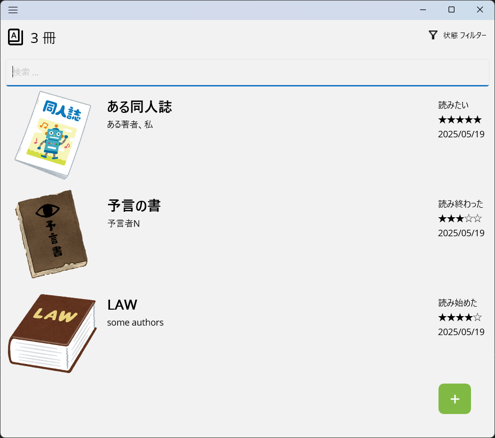

## 1. 説明

本の感想やメモを管理するアプリケーションです。

[.Net 8](https://dotnet.microsoft.com/ja-jp/)をインストールしたWindows 11やAndroidのスマートフォンで動きます。

本のバーコードをカメラで読み取って登録できます。

[読書管理ビブリア](https://biblia978.com/)や[ブクログ](https://booklog.jp/)で作成した記録も読み込めます。

### 1-2. 動機

iPhone SEで読書管理ビブリアを使っていましたが、Pixelに代えたため同じような広告がなく無料で使えるアプリが必要になり作成しました。

読書管理ビブリアでエクスポートしたCsvファイルを既存のアンドロイドアプリ（）に読み込ませれば済んだのですが、以下機能を追加すべく実装することにしました。

- 広告が煩わしい
- 青空文庫の本を登録したい
- 楽天にない本も登録したい
  - なお、楽天ブックスAPIはアプリIDの管理を本アプリ単体で実装できなかったため利用していません

## 2. 使い方

**読書の手帖**を起動したら、本の記録を登録します。

記録が終わったら、**読書の手帖**を終了します。

### 2-1. 読書の手帖を起動する

Windowsのスタートアップ等から、**読書の手帖（Book Techyo）** をクリックして起動します。

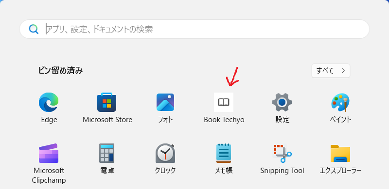

<!-- TODO 他の位置へ
### 2-2. 手帖ファイルを新規作成する、もしくは読み込む

**読書の手帖**のメニュー **ファイル** / **新規作成** をクリックし、新しく手帖ファイルを作成します。

すると**読書の手帖**は本の記録がない画面を表示します。

もしくは、**読書の手帖**のメニュー **ファイル** / **開く** をクリックし、以前に作成した手帖ファイルを読み込みます。

すると**読書の手帖**は以前に作成した本の記録を表示します。

 
-->

### 2-3. 本の記録を登録する

**読書の手帖**のをクリックします。

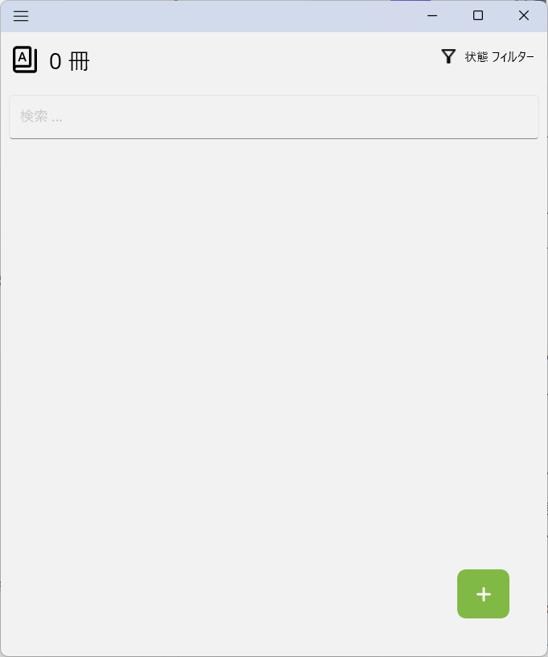

をクリックすると、バーコード読み取り 、書籍のタイトルで検索 、空の記録を追加 を表示します。

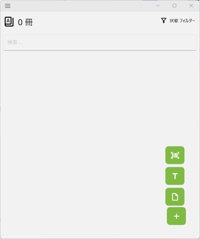

<!-- 本の記録がある場合は、一番上の記録をクリックしてから、**読書の手帖**のメニュー **編集** / **追加** / **上に追加** もしくは **下に追加** をクリックします。

 

**読書の手帖**は、本の記録を入力する詳細画面を表示します。タイトルや著者等を入力して、OKボタンを押下すると本の記録を登録完了できます。

-->

#### 2-3-1. バーコード読み取り

バーコード読み取り をクリックします。

**読書の手帖**は、バーコード読み取り画面を表示します。

書籍のバーコード（978で始まる数学が書いてある方）をカメラにかざし、読み取りが成功するまで位置を調整してください。

カメラ画像左上の数字は読み取りを行った回数を示します。

カメラ画像の下にあるスキャン間隔を増減すると読み取りを試みる単位時間当たりの回数を変更できます。
間隔を小さくしたほうが早く読み取りに成功する可能性が増えますが、負荷が増えます。

<!-- TODO 許可を表示するかも -->

バーコードの読み取りに成功すると、**読書の手帖**は読み取ったISBNを使って検索を行い結果を表示します。

一覧で書籍を選択して ダブルクリックしてください。

**読書の手帖**は、本の記録を入力する詳細画面に検索結果を反映します。

項目に入力して、をクリックすると、**読書の手帖**は一覧に登録します。

#### 2-3-2. 書籍のタイトルをキーにしてインターネットを検索する

をクリックします。

**読書の手帖**は、検索画面を表示します。

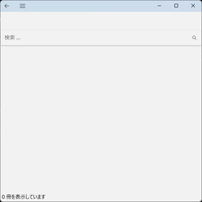

テキストボックスに検索する書籍のタイトルを入力してをクリックすると、**読書の手帖**は検索を行い結果を一覧で表示します。

なお、検索で利用するサービスおよびサービスごとの検索結果の上限数は[設定画面](#3-設定)で指定します。

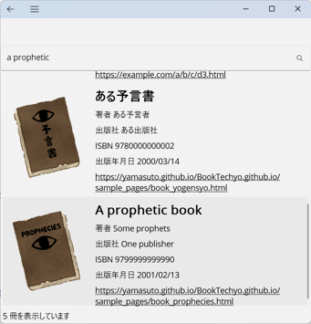

一覧で書籍を選択して ダブルクリックしてください。

**読書の手帖**は、本の記録を入力する詳細画面に検索結果を反映します。

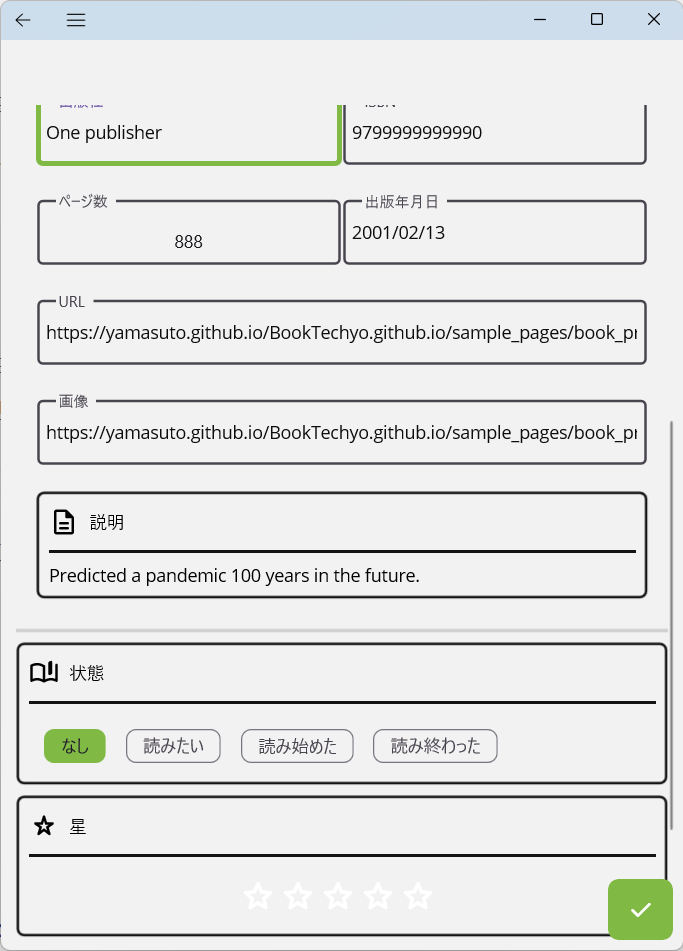

項目に入力して、をクリックすると、**読書の手帖**は一覧に登録します。

#### 2-3-3. 空の記録を追加する

をクリックします。

**読書の手帖**は、空の本の記録を入力する詳細画面を表示します。

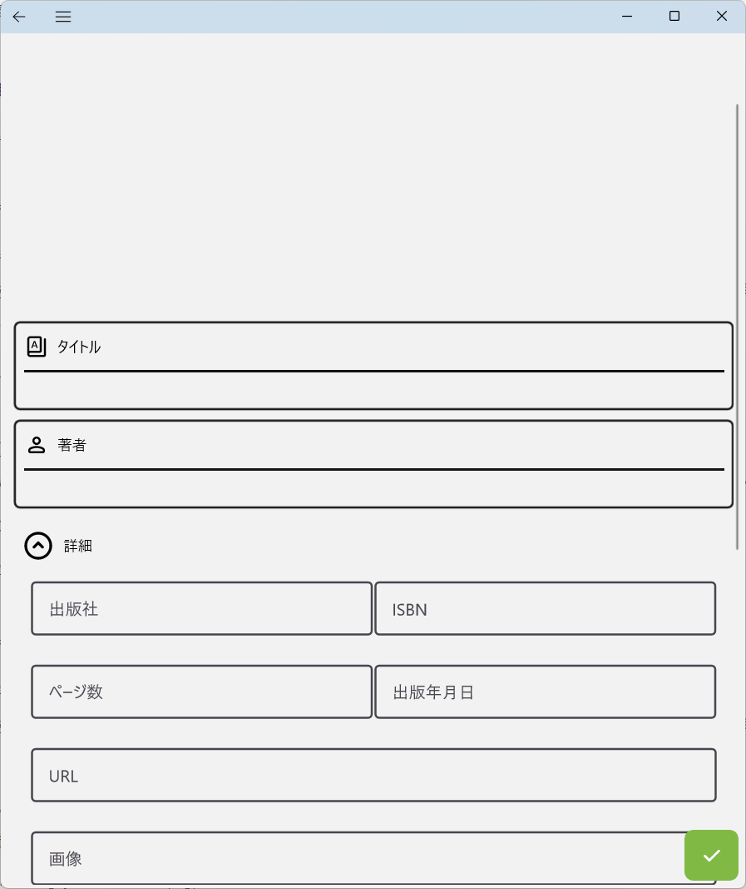

項目に入力して、をクリックすると、**読書の手帖**は一覧に登録します。

### 2-4. 本の記録を編集する

**読書の手帖**で編集する記録を選択すると、本の記録を入力する詳細画面を表示します。

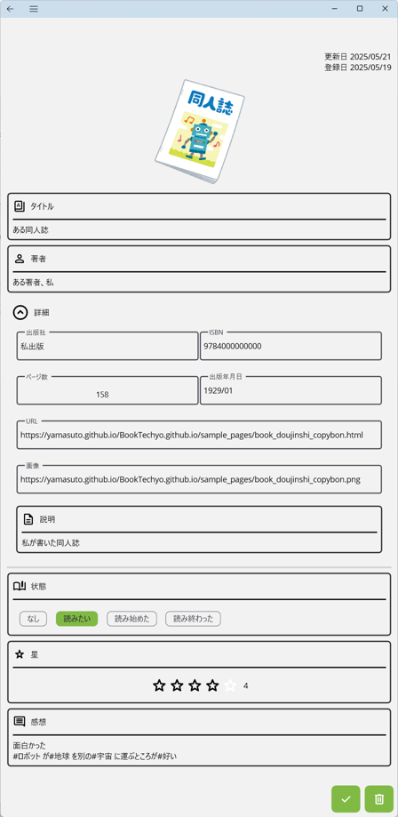

変更して、をクリックします。

**読書の手帖**は、変更した内容を反映した画面を表示します。

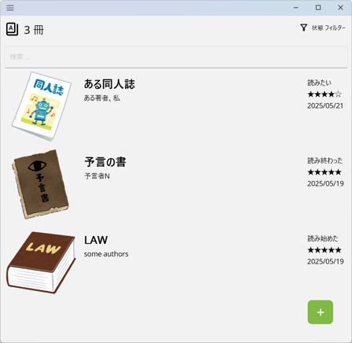

### 2-6. 読書の手帖を終了する

**読書の手帖**の右上側にある×ボタンをクリックするか、タスクバーの**読書の手帖**を右クリックして表示したメニューから[ウィンドウを閉じる]をクリックします。

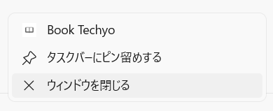

この時、**読書の手帖**は**未保存の変更を破棄します**ので注意してください。

## 3. 設定

**読書の手帖**の左上にあるをクリックして、表示したメニューから[設定]をクリックすると、設定画面を表示します。

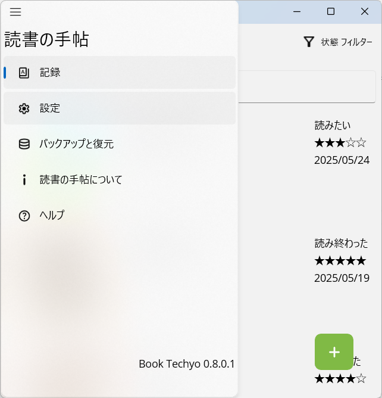

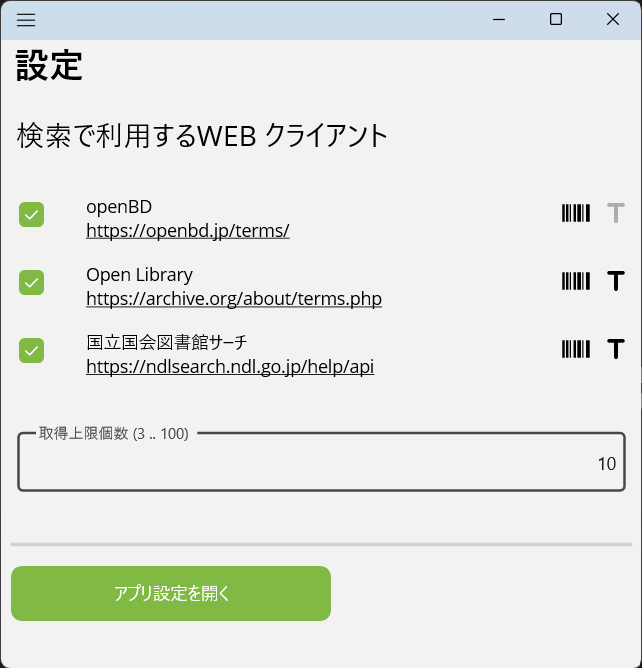

設定画面には上から

- 書籍検索サービスを利用する・しない、および優先度の指定
- 各書籍検索サービスで取得する結果の上限個数
- アプリ設定を開くボタン

があります。

### 3-1. 書籍検索サービスを利用する・しない、および優先度の指定

左側のチェックボックスにチェックがある検索サービスを使って書籍検索を行います。

全部チェックを外すと検索を行いません。

上にあるサービスから順番に検索を行います。

検索サービスの右側にがグレーでない色になっていればISBNでの検索時に利用します。がグレーでない色になっていれば書籍タイトルでの検索時に利用します。

### 3-2. 各書籍検索サービスで取得する結果の上限個数

3以上100以下の整数を指定します。

### 3-3. アプリ設定を開くボタン

クリックするとアプリ設定の画面を表示します。

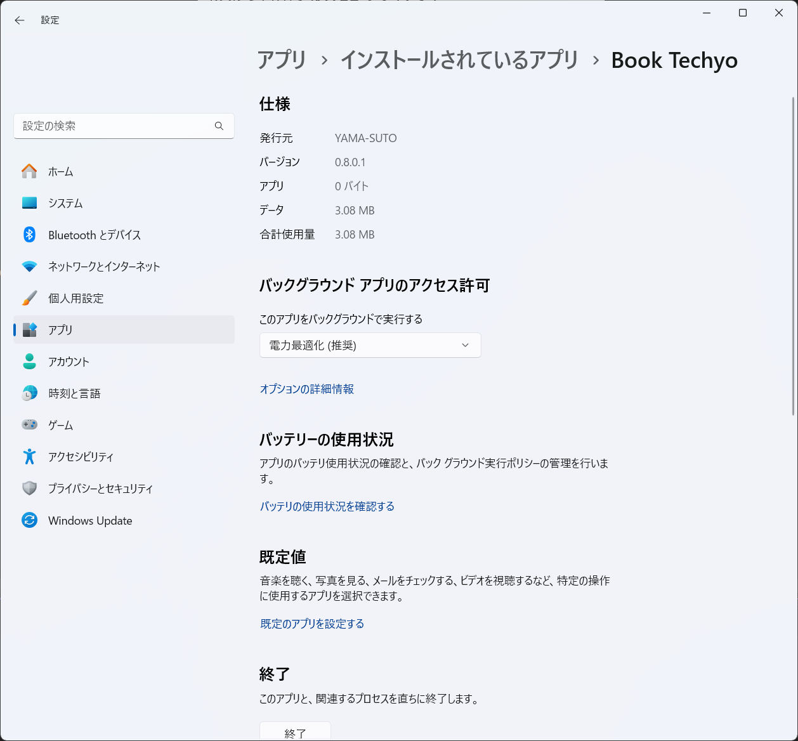

## 4. バックアップと保存

---
