# Book Techyo (WPF)

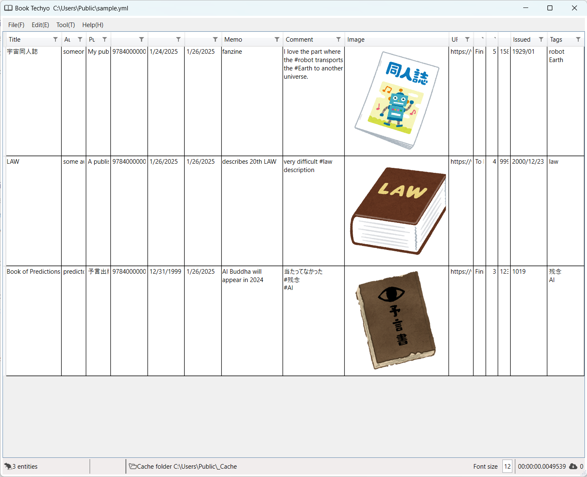

## 1. Description

This is an application for managing book impressions and notes.

It works on Windows 11 and Windows 10 with [.NET 8](https://dotnet.microsoft.com/en-us/) installed.

You can register books by scanning their barcodes with the camera.

It also supports importing and exporting records to and from [読書管理ビブリア](https://biblia978.com/) and [ブクログ](https://booklog.jp/).

## 2. How to Use

After launching **Book Techyo**, either open a new **Techyo file**[^1] or load an existing Techyo file to start registering book records.

Once you've finished recording, save the file and exit **Book Techyo**.

[^1]: The files used by **Book Techyo** are referred to as Techyo files. The file format is YAML, and the file extension is `.yml`.

### 2-1. Launching **Book Techyo**

Click **Book Techyo** from the startup menu or other places to launch the application.

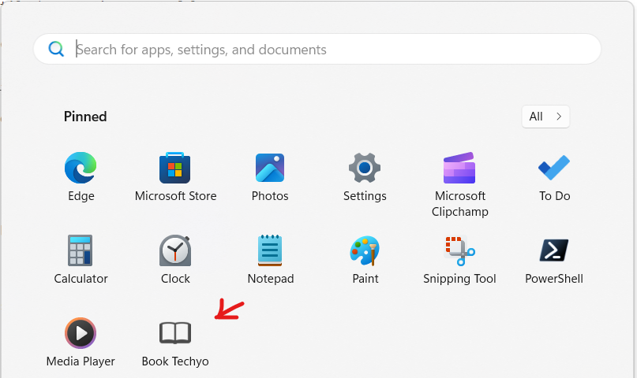

### 2-2. Create or Open a Techyo File

To create a new Techyo file, click **File** / **New File** in the menu.

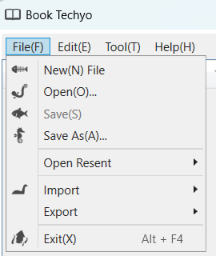

This will display a screen with no book records.

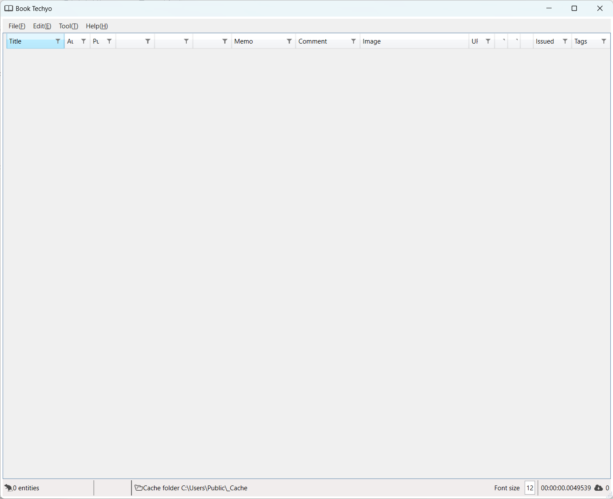

Alternatively, to open a previously created Techyo file, click **File** / **Open** in the menu.

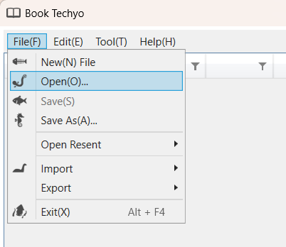

This will display the book records from the previously opened Techyo file.

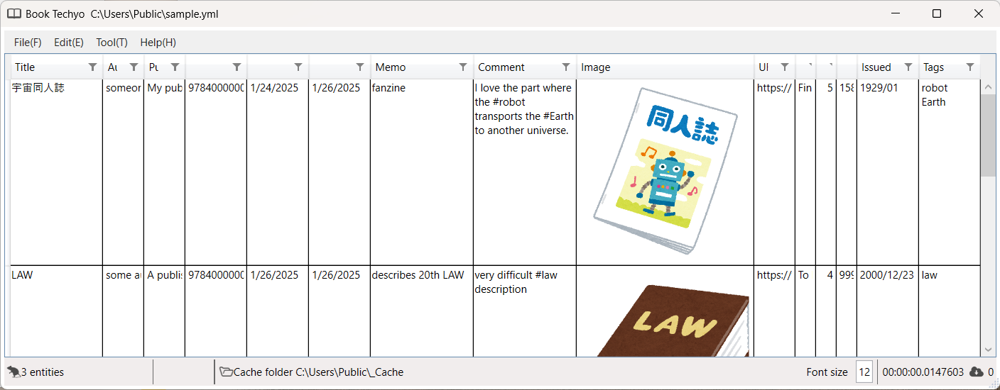

### 2-3. Registering a Book Record

If there are no existing records, click **Edit** / **Add** / **Add** from the menu.

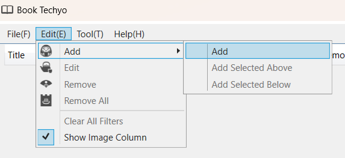

If there are existing records, click the top record, then click **Edit** / **Add** / **Add Selected Above** or **Add Selected Below** from the menu.

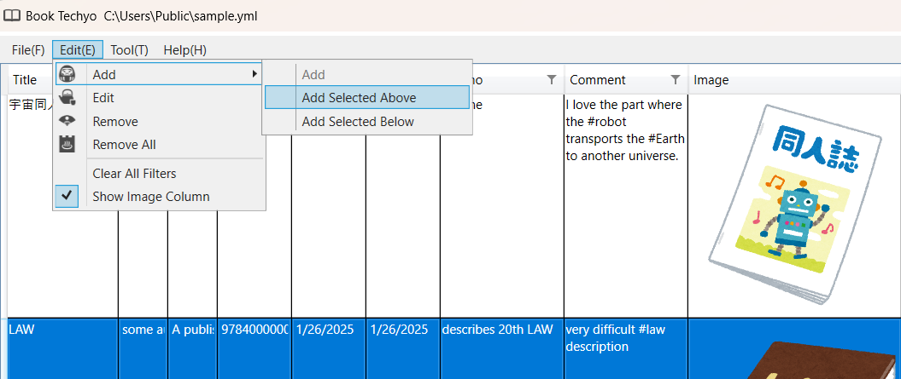

**Book Techyo** will display a screen for entering the book's record. After entering the title, author, etc., click the OK button to complete the record.

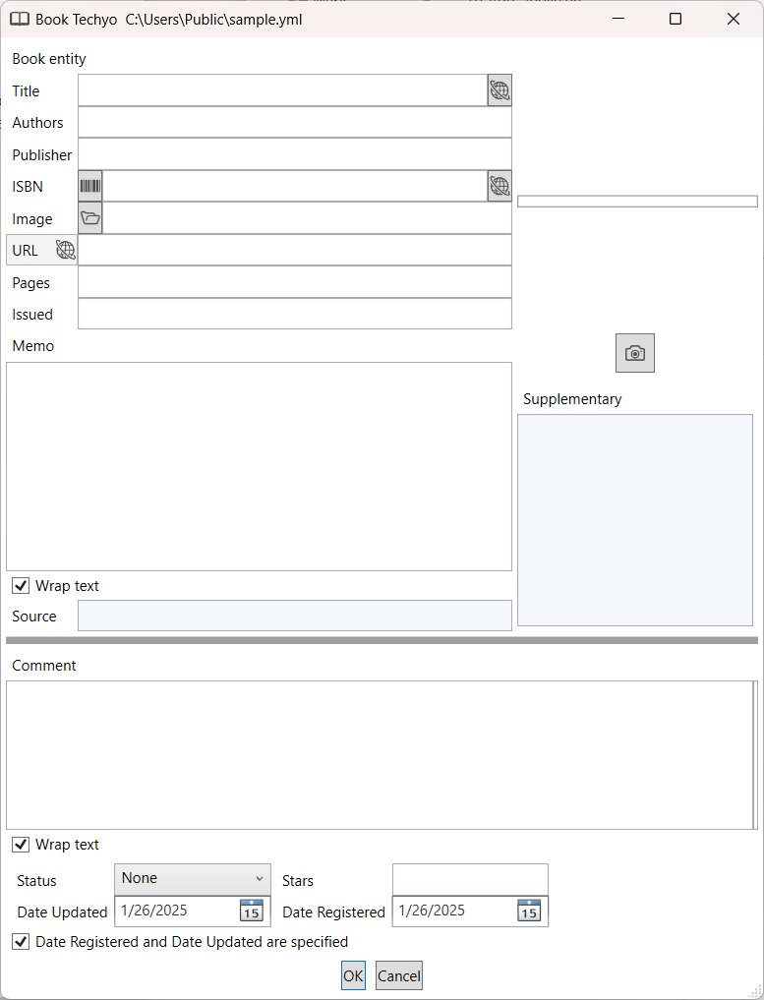

#### Search the Internet Using the Book Title

In the record input screen, enter the title of the book and click the .

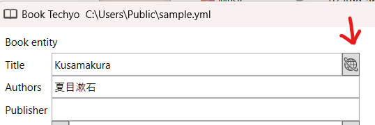

If you also input the author, it will search using both the title and author as the search key.

**Book Techyo** will display a book search screen. Choose a search service to use, check the terms of service, and then click the **Start** button. You may only use the service if you agree to the terms.

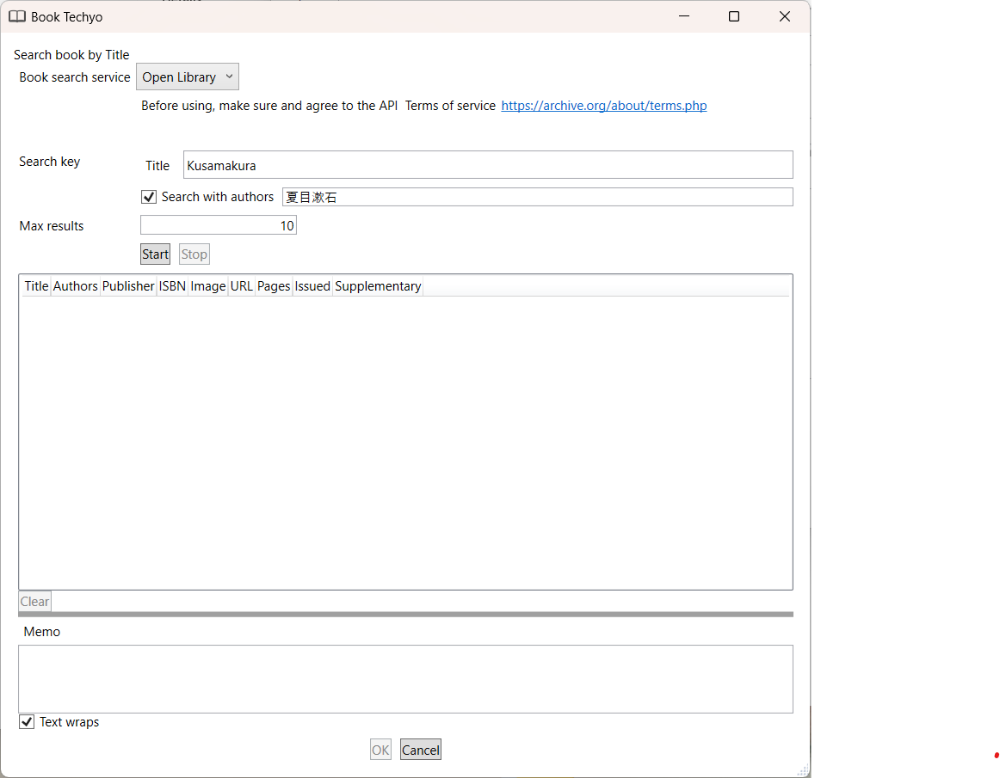

Once a book is found through the search, it will be listed.

Select a book from the list and click the **OK** button.

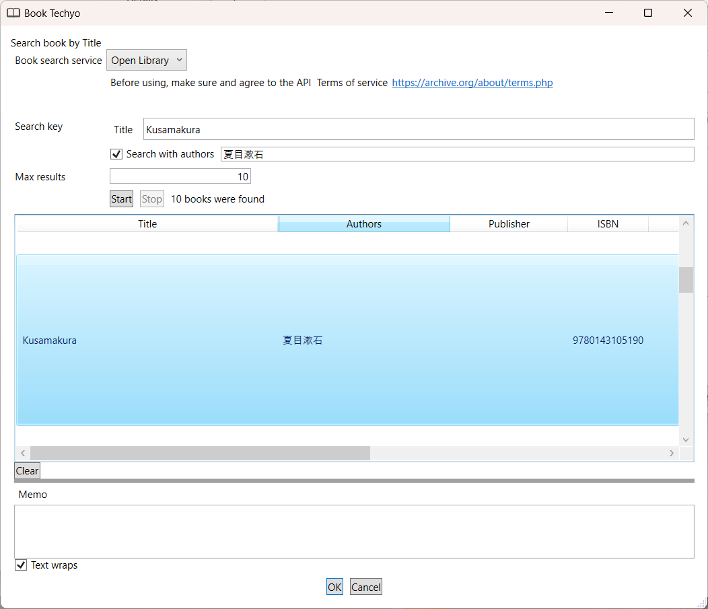

The book's record input screen will reflect the search results.

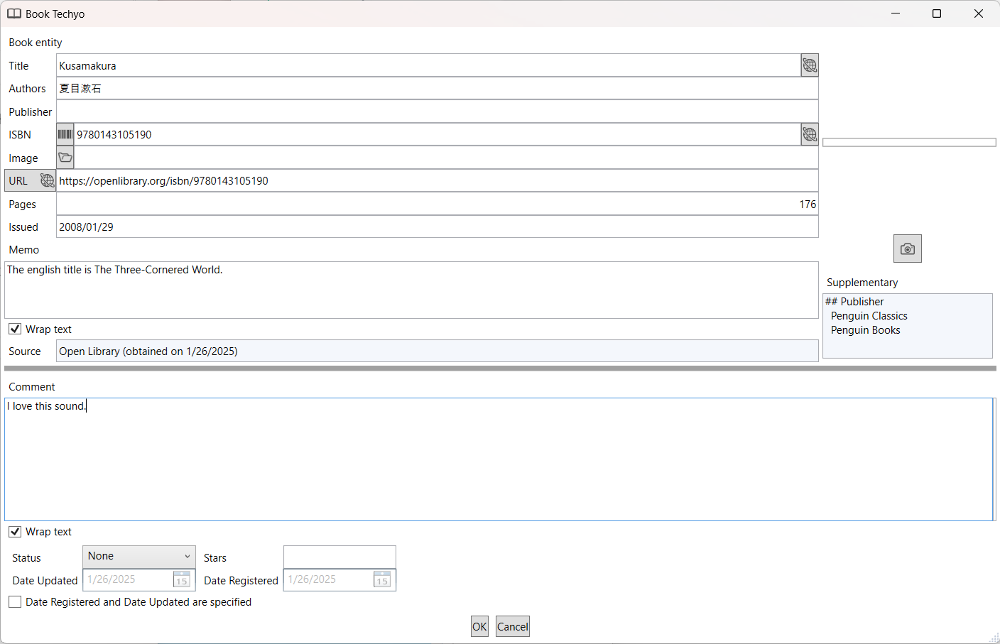

#### Scan a Barcode and Input the ISBN

In the book record input screen, click the .

**Book Techyo** will display the barcode scanning screen.

To search the Internet using the scanned barcode, check the **checkbox** and select the search service to use, ensuring you read and agree to the terms of service.

Hold the camera over the book's barcode and adjust until the scan is successful.

When the scan is successful, the ISBN will be displayed (search results will also appear if you opted to search the internet).

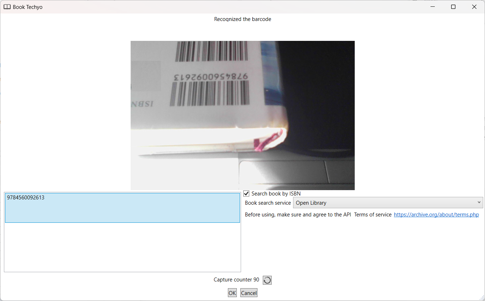

Select a book from the list and click the **OK** button.

The book record input screen will reflect the results.

### 2-4. Editing a Book Record

Once you've selected the record you want to edit, double-click it or click **Edit** from the menu.

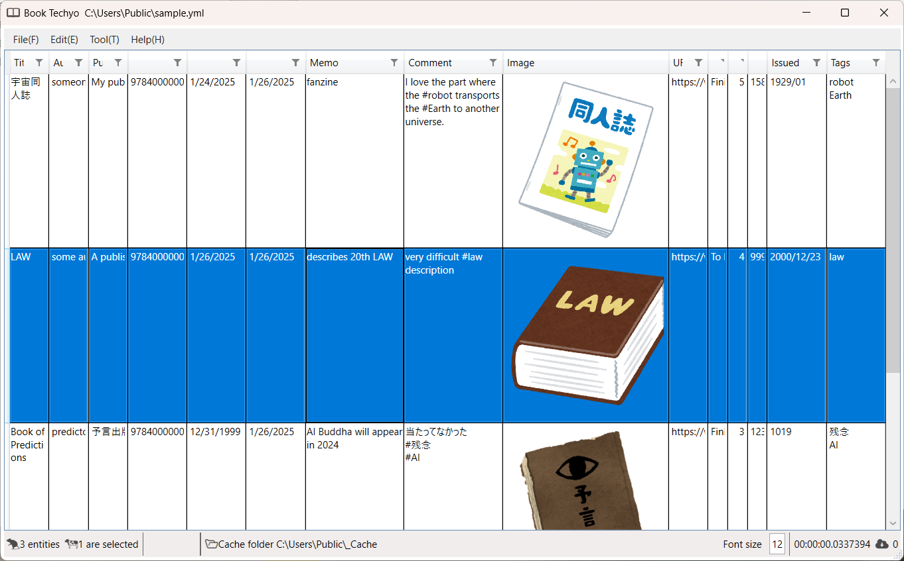

**Book Techyo** will display the book's record input screen.

Make any changes and click the **OK** button.

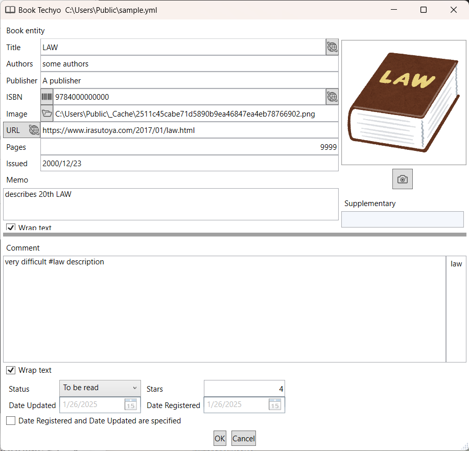

**Book Techyo** will display the updated screen with the changes applied.

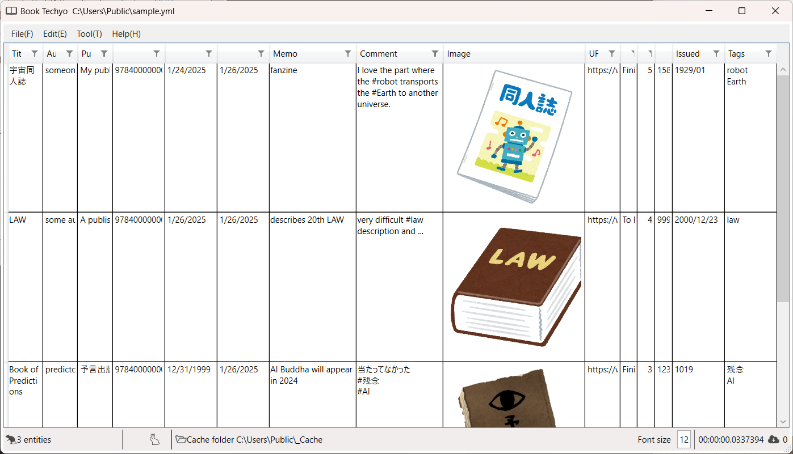

### 2-5. Saving the File

Click **File** / **Save** or **File** / **Save As** to save the changes to the Techyo file.

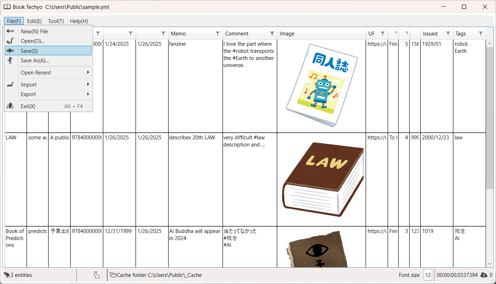

- Clicking **File** / **Save** will overwrite the currently open Techyo file.
- Clicking **File** / **Save As** will allow you to choose where to save the file.

### 2-6. Exiting **Book Techyo**

Click **File** / **Exit** to exit **Book Techyo**.

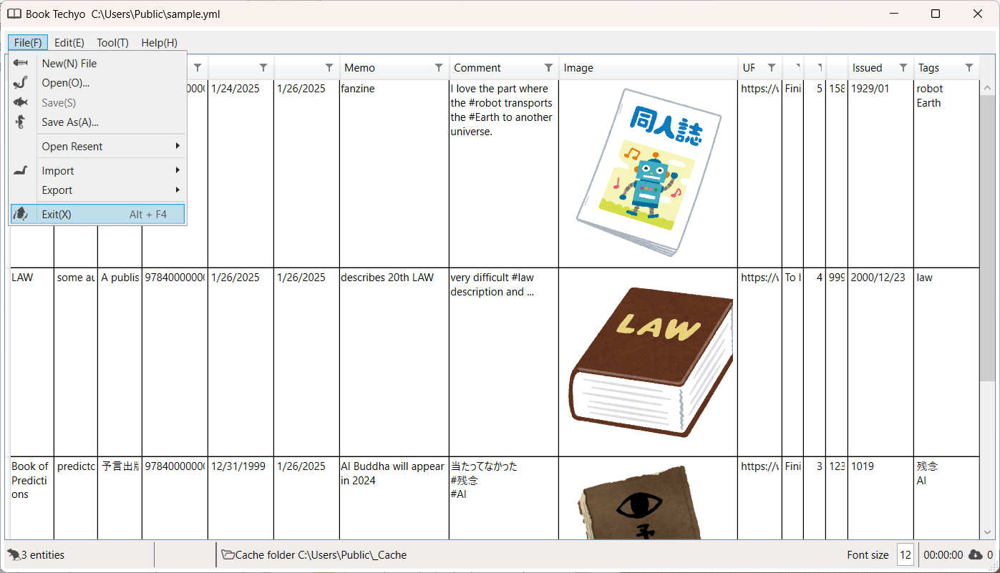

If you have unsaved changes, a confirmation dialog will appear.

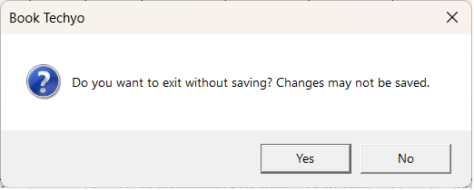

---
