# 読書の手帖（WPF版）

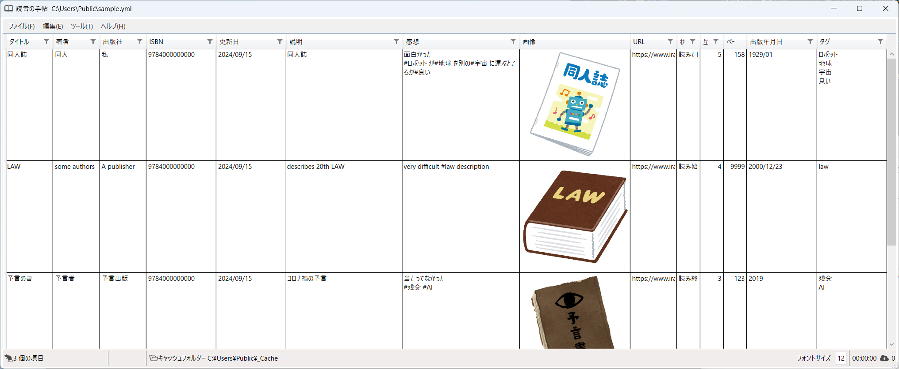

## 1. 説明

本の感想やメモを管理するアプリケーションです。

[.Net 8](https://dotnet.microsoft.com/ja-jp/)をインストールしたWindows 11, Windows 10で動きます。

本のバーコードをカメラで読み取って登録できます。

[読書管理ビブリア](https://biblia978.com/)や[ブクログ](https://booklog.jp/)で作成した記録の読み込み、書き込みもできます。

## 2. 使い方

**読書の手帖**を起動したら、新しく**手帖ファイル**[^1]を開くか、記録をつけている手帖ファイルを読み込んで、本の記録を登録します。

記録が終わったら、保存して**読書の手帖**を終了します。

[^1]: 読書の手帖のファイルを手帖ファイルと呼びます。ファイルフォーマットはYAMLで拡張子もymlです。

### 2-1. 読書の手帖を起動する

Windowsのスタートアップ等から、**読書の手帖**をクリックして起動します。

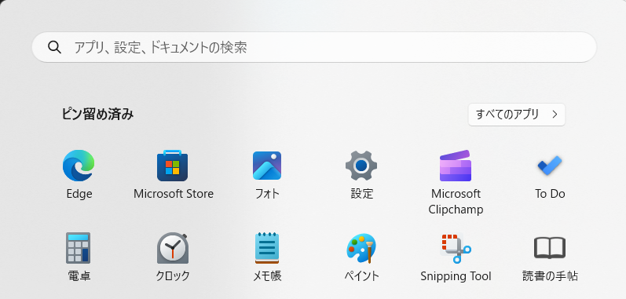

### 2-2. 手帖ファイルを新規作成する、もしくは読み込む

**読書の手帖**のメニュー **ファイル** / **新規作成** をクリックし、新しく手帖ファイルを作成します。

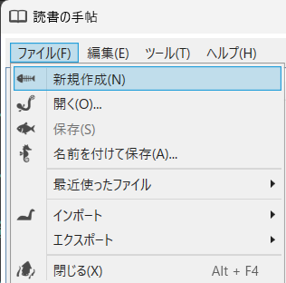

すると**読書の手帖**は本の記録がない画面を表示します。

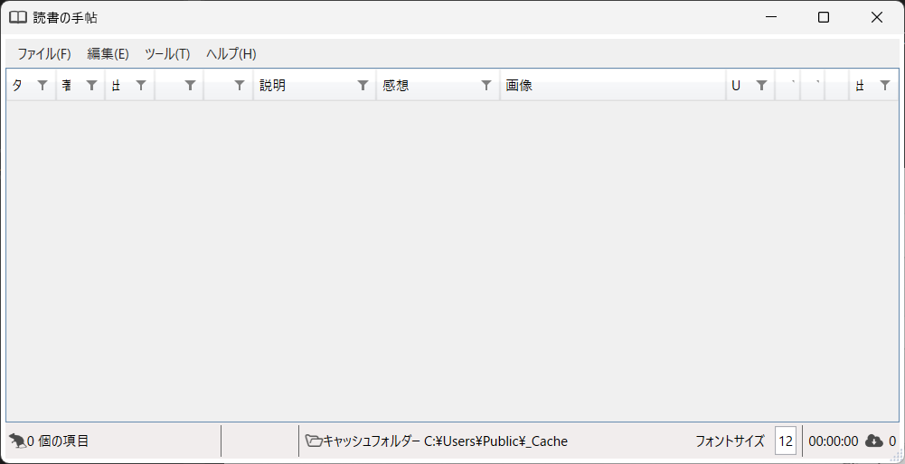

もしくは、**読書の手帖**のメニュー **ファイル** / **開く** をクリックし、以前に作成した手帖ファイルを読み込みます。

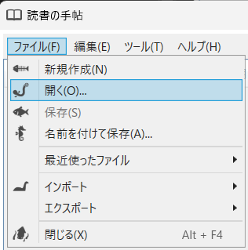

すると**読書の手帖**は以前に作成した本の記録を表示します。

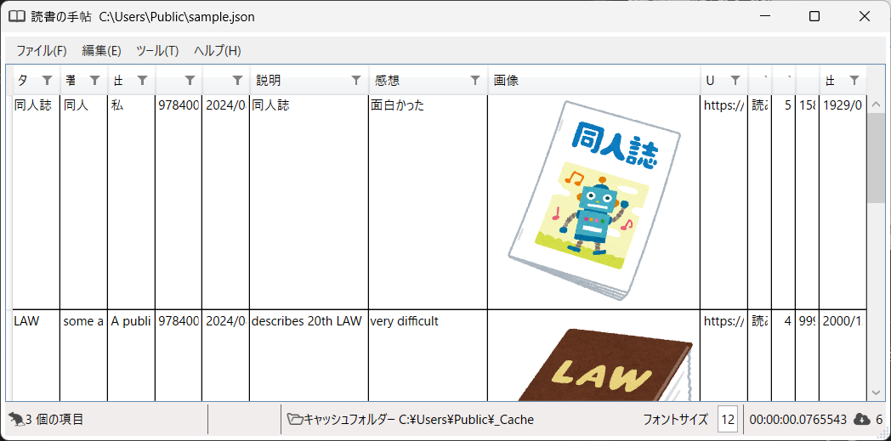

### 2-3. 本の記録を登録する

本の記録がないがない場合は**読書の手帖**のメニュー **編集** / **追加** / **追加**をクリックします。

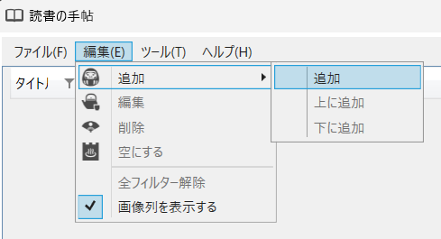

本の記録がある場合は、一番上の記録をクリックしてから、**読書の手帖**のメニュー **編集** / **追加** / **上に追加** もしくは **下に追加** をクリックします。

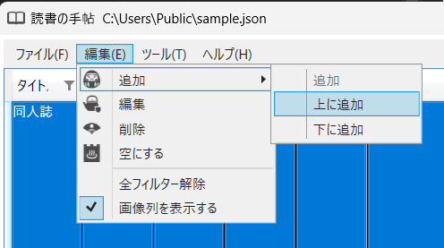

**読書の手帖**は、本の記録を入力する画面を表示します。タイトルや著者等を入力して、OKボタンを押下すると本の記録を登録完了できます。

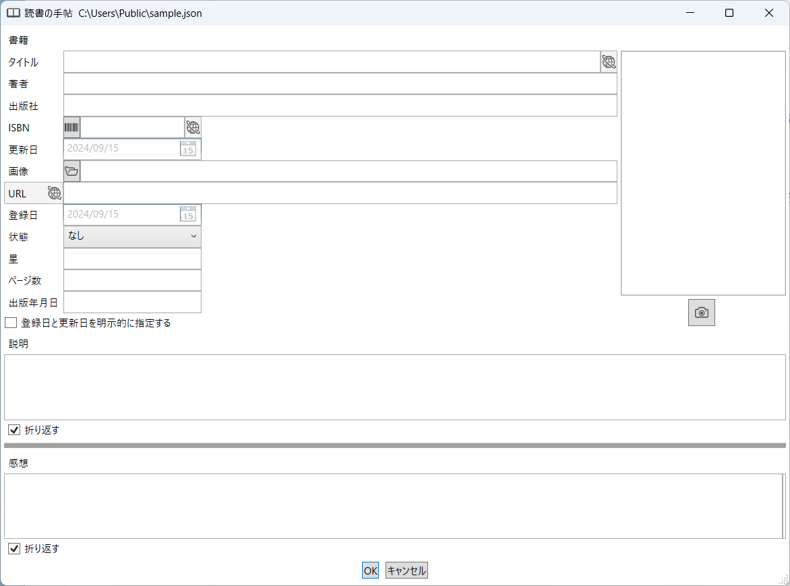

#### 書籍のタイトルをキーにしてインターネットを検索する

本の記録を入力する画面でタイトルを入力して、をクリックします。

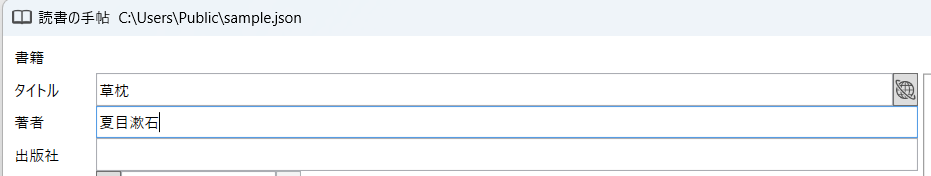

なお、著者も入力するとタイトルと著者を検索キーにしてインターネットを検索します。

**読書の手帖**は、書籍検索画面を表示します。利用する検索サービスを選択して、<ins>規約等を確認してから</ins> **開始** ボタンをクリックします。規約等に同意できる場合のみ利用してください。

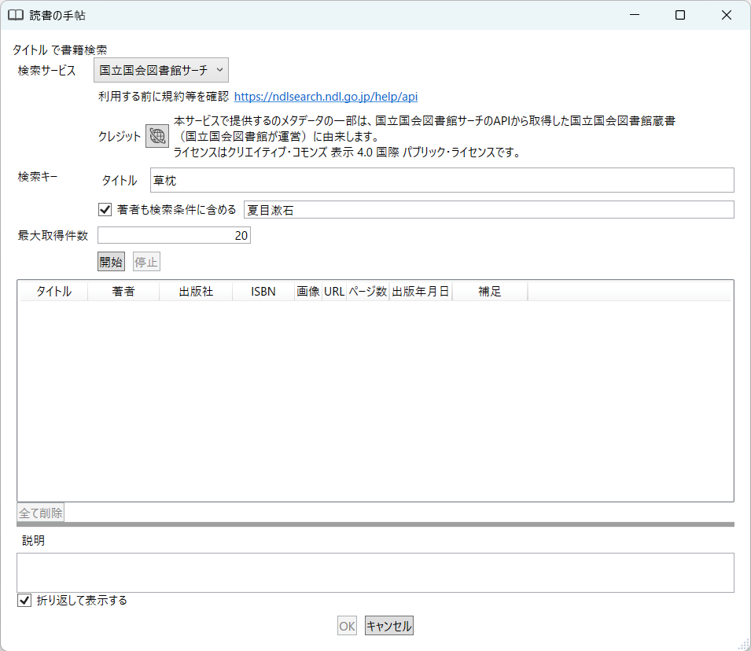

**読書の手帖**は、検索で書籍が見つかると一覧で表示します。

一覧で書籍を選択して **OK** ボタンをクリックしてください。

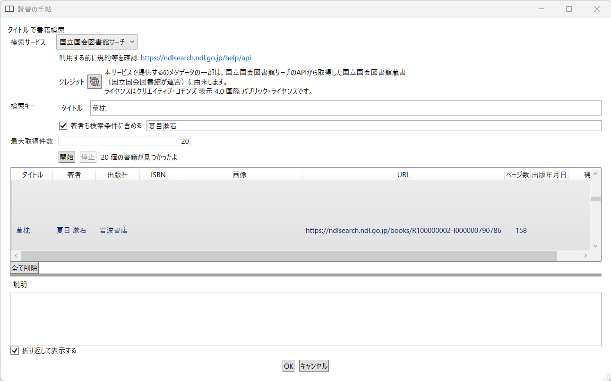

**読書の手帖**は、本の記録を入力する画面に検索結果を反映します。

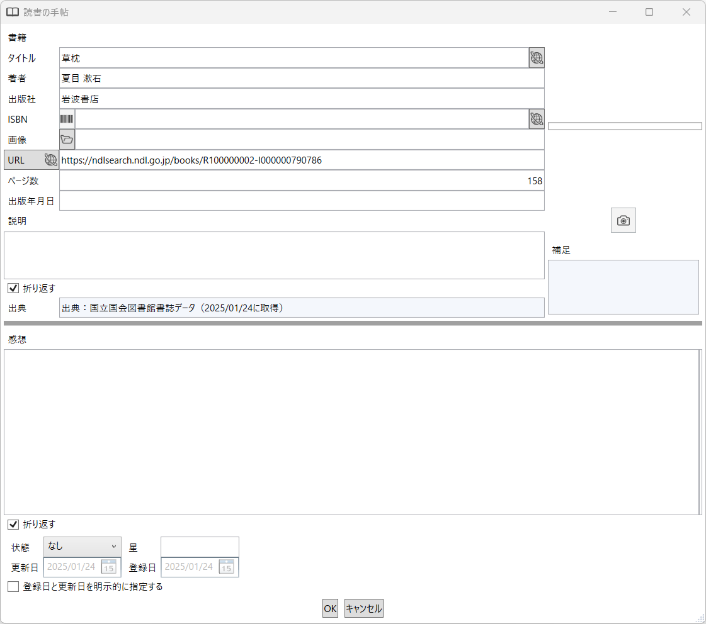

#### バーコードを読み取ってISBNを入力する

本の記録を入力する画面で、をクリックします。

**読書の手帖**は、バーコード読み取り画面を表示します。

読み取ったバーコードをキーにしてインターネットを検索する場合は、**チェックボックス** にチェックしてから利用する検索サービスを選択して、<ins>規約等を確認してください</ins>。規約等に同意できる場合のみ利用してください。

カメラに本のバーコード部分をかざして、読み取りが成功するまで位置を調整してください。

読み取りが成功すると、読み取ったISBNを表示します（インターネットを検索する場合は検索結果も表示します）。

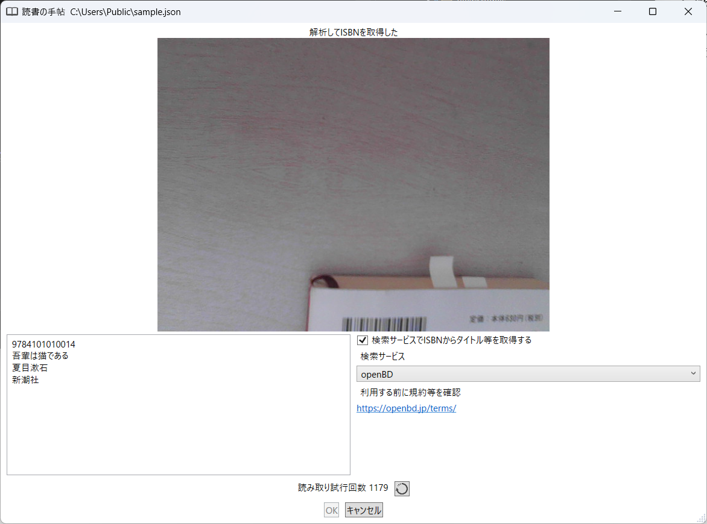

一覧で書籍を選択して **OK** ボタンをクリックしてください。

**読書の手帖**は、本の記録を入力する画面に結果を反映します。

### 2-4. 本の記録を編集する

**読書の手帖**で編集する記録を選択したら、ダブルクリックもしくはメニュー[編集][編集]をクリックします。

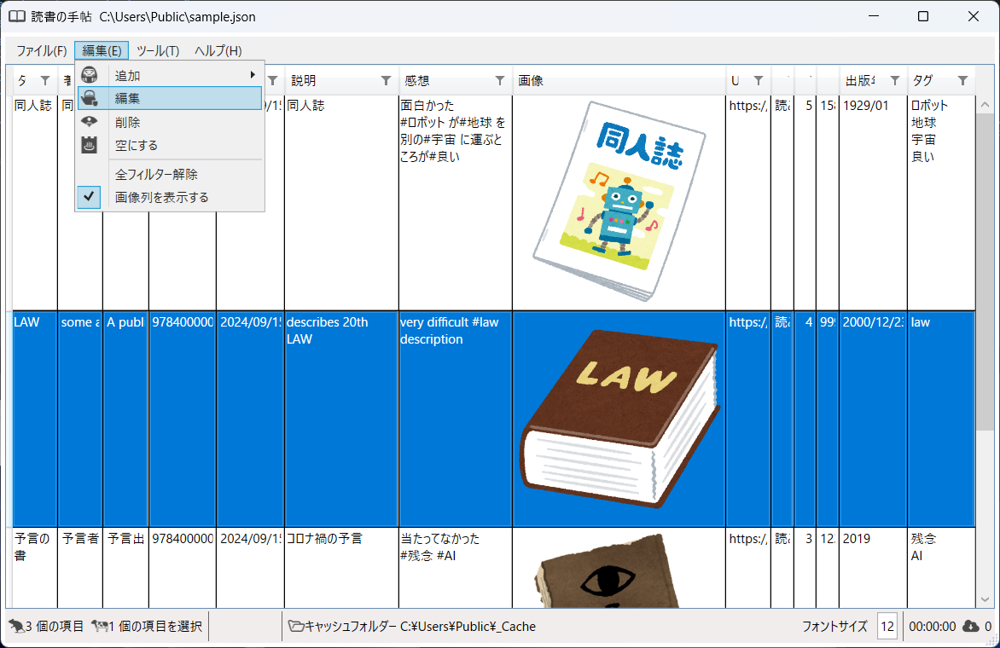

**読書の手帖**は、本の記録を入力する画面を表示します。

変更などおこない、**OK** ボタンをクリックします。

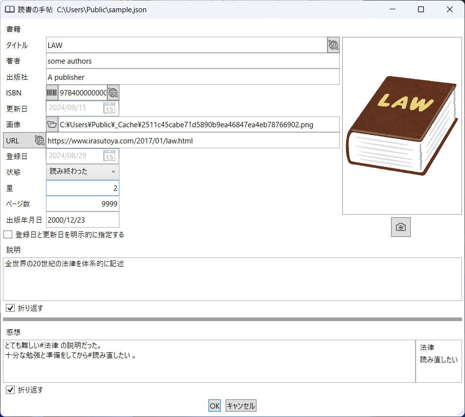

**読書の手帖**は、変更した内容を反映した画面を表示します。

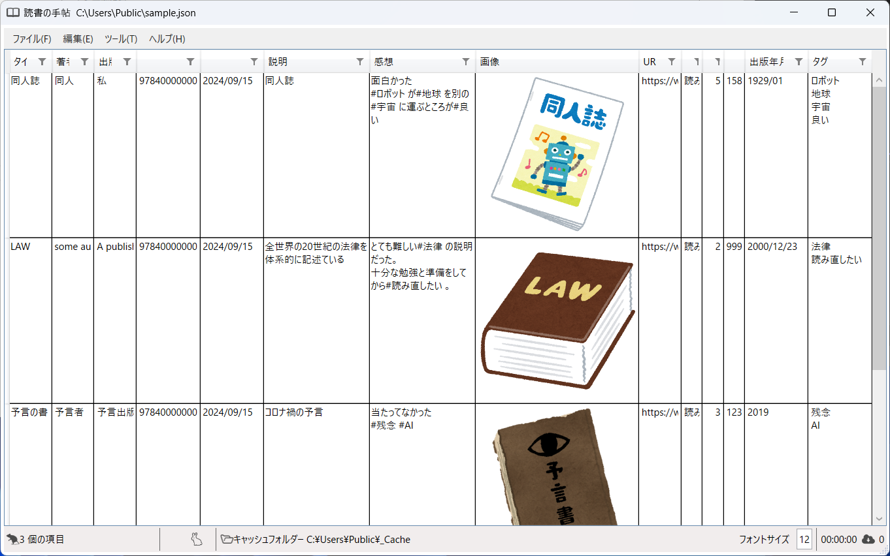

### 2-5. ファイルを保存する

**読書の手帖**のメニュー **ファイル** / **保存** もしくは **名前を付けて保存** をクリックし、変更した内容を手帖ファイルに保存します。

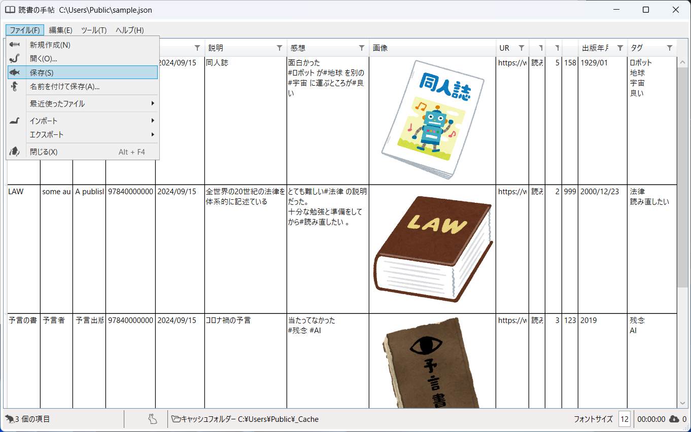

なお、**ファイル** / **保存** をクリックした場合は、開いている手帖ファイルに上書き保存します。**ファイル** / **名前を付けて保存** をクリックした場合は、指定したファイルに保存します。

### 2-6. 読書の手帖を終了する

**読書の手帖**のメニュー **ファイル**/ **閉じる** をクリックして、**読書の手帖**を終了します。

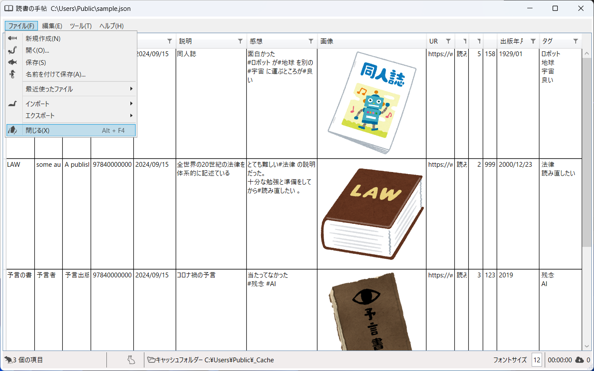

この時、変更後に保存を行っていない場合には確認ダイアログを表示します。

---
